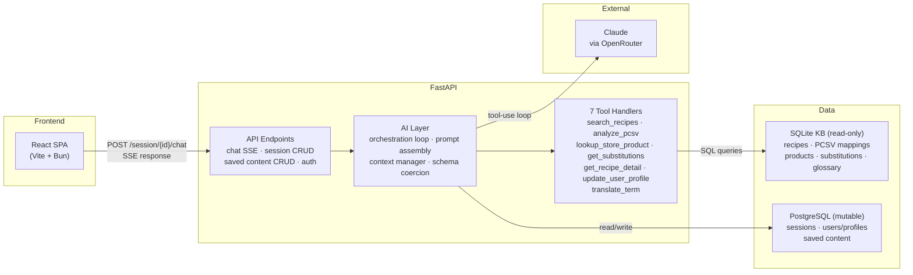

# Smart Grocery Assistant — Architecture Spec V2

**Date:** 2026-04-11 | **Status:** Active | **Owner:** Dako (@iDako7)

---

## Context

V1 built the AI layer as six separate REST endpoints with isolated prompts. V2 replaces this with a single conversational agent using tool-use, eliminating rigid endpoint routing and enabling cross-step context sharing. This document captures every architectural decision for the V2 system.

---

## 1. System Architecture

Three-layer architecture: Frontend → Backend API → External LLM.



**Backend:** Single FastAPI service that manages conversation sessions, hosts the knowledge base, implements tool handlers, and proxies LLM conversations via OpenRouter's tool-use API.

**Two databases by access pattern:** PostgreSQL for mutable data (sessions, saved content, user profiles, auth). SQLite for the read-only knowledge base (recipes, PCSV mappings, store products, substitutions) — simpler to seed, version, and ship as a file.

**Not chosen:**

- Serverless functions — tool-use conversations are stateful across multiple round-trips; requires persistent orchestration
- LLM directly from frontend — tools need DB access; can't expose KB or sessions to the browser

### Tech Stack

| Layer | Technology | Notes |
|---|---|---|
| **Frontend language** | TypeScript | |
| **Frontend framework** | React + Vite | SPA only, no SSR |
| **Frontend runtime** | Bun | Package manager + dev server |
| **UI components** | shadcn/ui + Tailwind CSS | Soft Bento design tokens |
| **Frontend state** | `useReducer` + Context | No Redux / Zustand |
| **Backend language** | Python | |
| **Backend framework** | FastAPI | Async, single service |
| **Schema validation** | Pydantic | Coercion pipeline, no re-prompting |
| **LLM provider** | Claude via OpenRouter | HTTP/JSON, no SDK |
| **Agent orchestration** | Explicit `while` loop (~40 lines) | No LangChain / LangGraph |
| **Streaming transport** | SSE (Server-Sent Events) | `POST /session/{id}/chat` → SSE stream back |
| **Knowledge base DB** | SQLite (read-only) | Shipped as a file in Docker image |
| **Mutable data DB** | PostgreSQL | Sessions, users, saved content |
| **Auth** | Magic link + JWT | Passwordless email; token in memory |
| **Deployment (Phase 2)** | Docker Compose → Render / DigitalOcean | Single instance |
| **Deployment (Phase 3)** | AWS ECS Fargate + RDS + CloudFront | Auto-scaling |

### Document Index

| Section | What it covers |
|---|---|
| **§2 — Conversation & Session Design** | How the full Home → Clarify → Recipes → Grocery flow is one continuous LLM thread; context compression strategy |
| **§3 — Responsibility Split** | What belongs to the LLM vs. backend vs. frontend; schema coercion hierarchy |
| **§4 — Agent Architecture** | Single-agent design; system prompt structure (persona / rules / tool instructions); cross-session user profile |
| **§5 — Tool Design** | All 7 tool contracts: params, return types, data source |
| **§6 — Knowledge Base** | SQLite schema domains (recipes, PCSV, products, substitutions); flavor tag system; vector search path |
| **§7 — User Profile** | Profile schema; how the agent reads and writes it; Phase 3 automated extraction |
| **§8 — Response Streaming (SSE)** | All SSE event types; Phase 2 collect-then-emit flow; Phase 3 progressive streaming upgrade |
| **§9 — API Contract** | All endpoints; `/chat` as the single LLM gateway; saved content CRUD |
| **§10 — Authentication** | Magic link flow; JWT strategy; Phase 2a mock auth for local dev |
| **§11 — Frontend Architecture** | Component tree; screen state machine (`IDLE → LOADING → STREAMING → COMPLETE`) |
| **§12 — Deployment** | Phase 2a Docker Compose → Phase 2b single instance → Phase 3 AWS |
| **§13 — Error Handling** | LLM failures; tool handler failures; SSE reconnection |
| **§14 — Mobile Strategy** | PWA-first; React Native as deferred upgrade path |
| **Phase Alignment table** | Every component mapped across Phase 1 / 2 / 3 |

---

## 2. Conversation & Session Design

**One continuous conversation per session with screen-aware checkpoints.**

The full Home → Clarify → Recipes → Grocery flow is one LLM conversation thread. Each screen transition is a new user message in that same thread. The backend tags each turn with the current screen for resumability and context management.

**Context compression:** Before each LLM call, a `build_context()` function compresses old turns into a state summary. The LLM always sees: system prompt + compressed prior state + recent messages. This bounds token costs while preserving reasoning continuity.

**Not chosen:**

- Stateless per-screen calls with re-injected context — loses the agent's ability to reference earlier reasoning; becomes a pipeline instead of a thinking partner

**Risk:** Context compression is an engineering challenge. Phase 2 starts with simple truncation (keep last N turns + summary), optimize in Phase 3 with usage data.

---

## 3. Responsibility Split

Each layer does what it's best at.

| Responsibility                                                                                                  | Owner        | Why                                            |
| --------------------------------------------------------------------------------------------------------------- | ------------ | ---------------------------------------------- |
| Understanding intent, reasoning about PCV gaps, choosing recipes, explaining suggestions                        | **LLM**      | Judgment, natural language, flexible reasoning |
| Executing KB queries, enforcing data schemas, managing sessions, validating constraints (dietary = hard filter) | **Backend**  | Deterministic, reliable, fast                  |
| Rendering structured UI, local interactions (check-off, expand/collapse), optimistic updates                    | **Frontend** | Instant feedback, no round-trip needed         |

**Data flow:** LLM produces loosely structured JSON → backend coerces it into strict types via Pydantic → frontend renders validated, typed data. Frontend never parses raw LLM text.

**Schema coercion hierarchy (no re-prompting for formatting issues):**

1. `json.loads()` — handles 95% (lowercase `true/false/null`)
2. Pydantic type coercion — string "3" → int 3
3. Field validators — semantic synonyms ("good" → "ok")
4. Default values — missing optional fields
5. Re-prompt — last resort, only for structurally broken output (<1% with good prompts)

---

## 4. Agent Architecture

**Single session agent** with one system prompt and seven tools. No multi-agent orchestration in Phase 2.

**Cross-session knowledge:** The agent reads a structured user profile (dietary restrictions, preferred cuisines, disliked ingredients, preferred stores) injected into every system prompt at assembly time. The agent updates this profile during conversation via the `update_user_profile` tool. This is the Phase 2 approach to cross-session memory — compact, deterministic, and sufficient for the grocery domain.

**Future scope:** A separate memory agent for cross-session _reasoning_ over conversation history (e.g., "what did I cook last Thanksgiving?") when saved content accumulates. Different tools, different prompt, different challenge — belongs in Phase 3 at earliest. The structured profile and read path remain unchanged when the memory agent is added.

**System prompt structure:** Four sections maintained as reusable prompt snippets (skill files), concatenated at build time:

- **Persona** — thinking partner framing, suggest don't dictate, tolerate vague input
- **Rules** — hard constraints (dietary restrictions are absolute, PCSV before creativity, prefer KB over generation, flag AI-generated recipes)
- **Tool instructions** — when to call each tool and in what order
- **Navigation context** — current screen in the flow (informational, does not constrain agent behavior per ADR-17)

**Prompt assembly rebuilds on every `/chat` call.** The user profile may change mid-session (via `update_user_profile`), so prompt assembly reads the latest profile from PostgreSQL each time rather than caching it at session start. Screen context from the request body is also injected as the navigation context section (see system prompt structure above).

Prompt content is designed and refined during Phase 1 through real conversations. No premature lock-down.

---

## 5. Tool Design

Seven tools. The LLM decides _what_ to look up, the backend decides _how_.

### 5.1 `search_recipes`

- **Params:** `ingredients[]`, `cuisine?`, `cooking_method?`, `effort_level?`, `flavor_tags[]?`, `serves?`
- **Returns:** List of recipe summaries (id, name, name_zh, cuisine, method, effort_level, flavor_tags, pcsv_roles, ingredients_have, ingredients_need)
- **Executes:** SQL query against SQLite recipe table

### 5.2 `analyze_pcsv`

- **Params:** `ingredients[]`
- **Returns:** `{protein: {status, items[]}, carb: {status, items[]}, veggie: {status, items[]}, sauce: {status, items[]}}`
- **Executes:** Deterministic lookup against PCSV mapping table. Not an LLM task — the lookup table is the source of truth for category assignments

### 5.3 `lookup_store_product`

- **Params:** `item_name`, `store?: "costco" | "community_market"`
- **Returns:** `{product_name, package_size, department, store, alternatives[]}`
- **Executes:** Fuzzy match against store product data

### 5.4 `get_substitutions`

- **Params:** `ingredient`, `reason?: "unavailable" | "dietary" | "preference"`
- **Returns:** List of `{substitute, match_quality, notes}`

### 5.5 `get_recipe_detail`

- **Params:** `recipe_id`
- **Returns:** Full cooking instructions, ratios, tips, source attribution
- **Purpose:** Keeps initial `search_recipes` responses lightweight; fetched when user expands a recipe card

### 5.6 `update_user_profile`

- **Params:** `field` (enum: household_size, dietary_restrictions, preferred_cuisines, disliked_ingredients, preferred_stores, notes), `value`
- **Returns:** `{updated: true, field, new_value}`
- **Executes:** Write to PostgreSQL user profile table
- **Purpose:** Persists preferences and restrictions learned during conversation. The agent calls this when users mention dietary needs, cuisine preferences, or other persistent facts — e.g., "I'm halal" triggers an update to `dietary_restrictions`

### 5.7 `translate_term`

- **Params:** `term`, `direction?: "en_to_zh" | "zh_to_en" | "auto"`
- **Returns:** `{term, translation, direction, match_type: "exact" | "partial" | "none"}`
- **Executes:** Lookup against glossary table in SQLite. Covers ingredient names, cooking terms, grocery terms.

### Design notes

- No "generate_recipe" tool — when KB has no match, the LLM falls back to generation in its response text, flagged as "AI-suggested"
- Fridge recall (OQ-1) — removed from scope. The system relies on what users tell it in each session, not purchase history tracking.

---

## 6. Knowledge Base

SQLite as a single-file, read-only KB with four logical domains:

- **Recipes** — indexed by ingredients, PCSV categories, cuisine, method, effort_level, flavor_tags. Source attribution field ("Kenji / The Food Lab" vs "AI-suggested"). Compact detail blob for cooking instructions

**Effort levels:** `quick` (~15 min or less, minimal active prep), `medium` (~15–45 min, moderate prep), `long` (45+ min or requires marinating/slow cooking). Qualitative by design — a "30-minute" recipe with 20 minutes of knife work feels harder than a "45-minute" recipe where 30 minutes is unattended oven time.

**Flavor tag schema:** Each recipe carries a `flavor_tags` array drawn from two tiers:

- **Taste** (5 basics): sweet, salty, sour, bitter, umami
- **Sensory descriptors**: spicy, creamy, smoky, fresh, rich, numbing, tangy, herbal, aromatic

A recipe typically has 2–4 tags (e.g., Mapo Tofu: `[umami, spicy, numbing]`; teriyaki chicken: `[sweet, umami, rich]`). The tag vocabulary is a flat list now but designed to expand to full aroma profile dimensions (citrus, floral, woody, etc.) in a future phase. New tags can be added without schema migration.

- **PCSV mappings** — ingredient → category lookup. Multi-role supported (beans → protein + carb)
- **Store products** — item, package size, department, store. Starting with Costco Vancouver + local community markets. No price data
- **Substitutions** — ingredient pairs with match quality and context tags (dietary, cultural, availability)

**Vector search:** sqlite-vss extension allows adding embedding columns alongside regular tables for future semantic search. Start with attribute-based filtering (SQL `WHERE` clauses), add vector reranking when usage data shows where keyword matching falls short. Fallback option: DuckDB if sqlite-vss proves limiting.

**Schema design deferred** until recipe source data (Kenji's books, store product lists) is in hand.

---

## 7. User Profile

**Structured profile document** stored in PostgreSQL, read at prompt assembly time. The agent sees the full profile in every system prompt (~500 tokens).

**Schema:**

| Field                  | Type     | Example                                                |
| ---------------------- | -------- | ------------------------------------------------------ |
| `household_size`       | int      | 4                                                      |
| `dietary_restrictions` | string[] | ["halal"]                                              |
| `preferred_cuisines`   | string[] | ["Chinese", "Korean", "Mexican"]                       |
| `disliked_ingredients` | string[] | ["cilantro", "blue cheese"]                            |
| `preferred_stores`     | string[] | ["costco", "t&t"]                                      |
| `notes`                | string   | "Husband doesn't eat spicy. Kids prefer mild flavors." |

**Write path (Phase 2):** The agent calls `update_user_profile` during conversation when users mention persistent facts. Example: "I'm halal" → agent updates `dietary_restrictions` and acknowledges the change.

**Read path:** `build_prompt()` reads the profile from PostgreSQL on every `/chat` call. The profile is injected as a dedicated section in the system prompt, after persona/rules and before tool instructions.

**Phase 3 evolution:** Add an automated writer — a background process or session-end hook that extracts new facts from completed conversations and merges them into the profile. The profile schema and read path remain unchanged.

**Risk:** The `notes` field could grow unbounded if the agent appends without curation. Mitigate with a size cap and periodic summarization.

---

## 8. Response Streaming (SSE)

The `/chat` endpoint returns a streaming response in SSE wire format (`event:`, `data:`, `\n\n`). The transport is a POST response stream (not a GET-based `EventSource` connection) because the client needs to send a request body (user message + screen context) with each call. The frontend reads the response via `fetch()` + `ReadableStream` and parses SSE lines. Each event is a typed JSON payload representing an incremental UI update.

### Event types

```
event: thinking       → status message ("Analyzing your ingredients...")
event: pcsv_update    → PCSV category indicators
event: recipe_card    → one recipe card (emitted per card as available)
event: explanation    → agent's reasoning text
event: grocery_list   → store-grouped shopping list (reserved in Phase 2 — grocery list generation uses a dedicated endpoint, not the /chat SSE flow; the GroceryStore model is reused as the response type)
event: error          → error with context
event: done           → completion signal with status ("complete" | "partial")
```

### Stream flow (Phase 2: collect-then-emit)

```
User msg → Backend sends to LLM
  ├─ emit thinking ("Analyzing your ingredients...")
  ├─ LLM calls analyze_pcsv → backend runs it → emit thinking ("Searching recipes...") → return result to LLM
  ├─ LLM calls search_recipes → backend runs it → emit thinking ("Building your plan...") → return result to LLM
  └─ LLM produces final response → emit pcsv_update, recipe_card (×N), explanation, done
```

The orchestration loop runs to completion, then emits all typed events in rapid sequence. During the loop, only `thinking` status strings are streamed — enough to show progress without interleaving orchestration with event emission.

**Phase 3 upgrade: progressive streaming.** Emit `pcsv_update` and `recipe_card` events inside the loop as each tool completes, so users see results populating before the agent finishes reasoning. This shares identical SSE event types and tool handlers — the change is moving `emit_sse()` calls from after the loop to inside it.

**Not chosen:**

- WebSocket — bidirectional is overkill; client sends via POST, server streams back
- Polling — latency spikes, wasted requests during 5-15 second tool-use loops
- Wait for complete response — 10-second blank screen kills the experience

**Partial failure:** The `done` event carries a status field. On "partial", frontend shows what it has plus a retry prompt for missing parts.

---

## 9. API Contract

### Endpoints

| Endpoint                  | Method     | Purpose                                                        |
| ------------------------- | ---------- | -------------------------------------------------------------- |
| `POST /session`           | Create     | Starts a new session, returns `session_id`                     |
| `POST /session/{id}/chat` | SSE stream | Sends user message + screen context, streams back typed events |
| `GET /session/{id}`       | Read       | Returns current session state (for page refresh / resume)      |
| `POST /session/{id}/grocery-list` | Create | Deterministic grocery list generation from checked buy items (no LLM). Returns `GroceryStore[]` |
| `POST /auth/send-code`    | Auth       | Sends magic link or 6-digit code to email                      |
| `POST /auth/verify`       | Auth       | Validates code, returns JWT                                    |

Saved content (meal plans, recipes, grocery lists) gets standard CRUD endpoints — no LLM involvement. Saving writes current session state to PostgreSQL.

The `/grocery-list` endpoint is the only non-chat data generation path. It bypasses the AI layer entirely — fuzzy-matching ingredients against the product KB, grouping by store/department, and returning items not found in an 'Other' section. See `orchestrator-behaviors-v1.md` §2 for the full behavioral spec.

The `/chat` endpoint is the core. All LLM interactions flow through it: screen transitions, chat corrections, swap requests. The `screen` field in the request body is a context hint injected into the system prompt as navigation context (see §4) and used for logging. It does not constrain agent behavior or filter which event types are emitted (ADR-17). The backend always emits all relevant event types; the frontend decides what to render based on the current screen.

---

## 10. Authentication

**Magic link (passwordless email) + JWT tokens.**

1. User enters email → backend sends a 6-digit code
2. User enters code → backend issues a JWT
3. JWT sent as `Authorization: Bearer` header on all requests
4. Backend validates JWT via middleware on all endpoints except `/auth/*`

**Why magic link:** No password storage, no hashing, no "forgot password" flow. Lower friction for a grocery app. One fewer attack surface.

**Why JWT over server-side sessions:** Stateless — no session lookup per request. Works naturally with SSE (token sent on connection start). Frontend stores token in memory (not localStorage — XSS risk).

**Future:** OAuth (Google/Apple) is a clean addition — same JWT flow, different issuer. Not needed for Phase 2 validation with a small user group.

**Phase 2a (local development):** Mock auth — a hardcoded dev user with a pre-issued JWT. The full API contract (Bearer token on all requests, JWT middleware) is real; only the email verification step is stubbed. This lets frontend and backend develop against the real auth contract without an email service dependency.

---

## 11. Frontend Architecture

React SPA with SSE client, screen-based state machine, and component library.

```
App
├── SSEClient          → singleton, manages streaming fetch (POST → ReadableStream → SSE parse)
├── SessionState       → accumulated SSE events → typed state (useReducer + Context)
├── Screens (core flow)
│   ├── Home           → text input, quick-start chips, no SSE
│   ├── Clarify        → PCV indicators, clarify questions, chat input
│   ├── Recipes        → recipe cards, swap interaction, chat input
│   └── Grocery        → store-grouped checklist, no chat input
├── Screens (saved content — full-screen detail, accessed from Sidebar)
│   ├── SavedMealPlan  → expandable recipe list, no chat input — manual editing only (S5, S6)
│   ├── SavedRecipe    → editable recipe card, no chat input — in-place edit only (S6)
│   └── SavedGroceryList → checklist with add/remove, copy to clipboard
├── Sidebar            → saved content index (meal plans, recipes, grocery lists)
├── ChatInput          → shared component on Clarify and Recipes screens
└── InfoSheet          → bottom sheet for recipe info (bilingual name, flavor tags, description)
```

**State pattern:** Each SSE event type maps to a state slot. Components render whatever state exists — no "wait for all data" gate. Screen state machine: `IDLE → LOADING → STREAMING → COMPLETE`.

**Tech:** React + TypeScript, Vite, Bun (package manager), shadcn/ui (component primitives), Tailwind CSS (styling — Soft Bento design tokens mapped to Tailwind config), `useReducer` + Context (state management). No meta-framework — single-page app doesn't need SSR.

---

## 12. Deployment

**Phased approach: local-first, scale when needed.**

**Phase 2a (local development):**

```
Docker Compose (local)
├── fastapi-app (backend + SQLite KB bundled)
├── postgres (sessions, saved content, users)
└── Frontend: Vite dev server (hot reload, proxied to backend)
```

**Phase 2b (single-instance deployment):**

```
Cloud host (Render / DigitalOcean App Platform)
├── Web service: FastAPI (backend + SQLite KB bundled)
├── Managed PostgreSQL
└── Frontend: static files served by CDN or same host
```

**Phase 3 (AWS, scalable):**

```
AWS
├── ECS Fargate (FastAPI containers, auto-scaling)
│   └── SQLite KB bundled per container (read-only, no shared state)
├── RDS PostgreSQL (managed, connection pooling via PgBouncer)
├── ALB (Application Load Balancer — native SSE support, sticky sessions if needed)
├── S3 + CloudFront (frontend static files)
└── ElastiCache Redis (rate limiting, session cache — added when needed)
```

**Scale-ready by design:**

- SQLite for KB (read-only, copied per container when scaling)
- PostgreSQL for sessions (shared across instances)
- Stateless JWT auth (no server-side session affinity)
- No hardcoded localhost references

**Not chosen:**

- Serverless (Lambda/Cloud Run) — SSE requires long-lived connections; timeout management is awkward
- Kubernetes — premature for validation phase

**Future exploration:** AWS-specific load testing with k6 will identify bottlenecks before scaling investment. Expected bottleneck: OpenRouter API latency, not backend.

---

## 13. Error Handling

**LLM failures:** If the OpenRouter API call fails mid-orchestration (timeout, 5xx, rate limit), the backend retries once with exponential backoff. If the retry fails, return partial results — whatever tools completed successfully — with `done: {status: "partial", reason: "llm_error"}`. The frontend shows what it has plus a retry button.

**Tool handler failures:** If a tool handler throws (bad SQL, missing data), the error is returned to the LLM as a tool result: `{error: "..."}`. The LLM can reason about the failure and adjust (skip that tool, try different parameters, or explain the limitation to the user). This avoids aborting the entire orchestration for a single tool failure.

**SSE connection drops:** The `done` event carries a status field. If the client reconnects mid-stream, `GET /session/{id}` returns the current session state so the frontend can rebuild from the last checkpoint.

---

## 14. Mobile Strategy

**PWA-first.** The React SPA gets a service worker and web app manifest, making it installable on mobile home screens. This provides a native-like experience (full screen, no browser chrome) without a separate codebase.

**React Native (deferred).** If PWA limitations become blocking (push notifications, native gestures), a React Native app consuming the same API is the upgrade path. The screen-agnostic API design ensures the backend requires no changes.

---

## Phase Alignment

| Component          | Phase 1 (Prove)                 | Phase 2 (Ship)                             | Phase 3 (Optimize)                   |
| ------------------ | ------------------------------- | ------------------------------------------ | ------------------------------------ |
| Orchestration loop | Claude artifact, manual testing | FastAPI, explicit while-loop               | Parallel tool dispatch               |
| Prompt assembly    | Inline system prompt            | Skill file concatenation                   | A/B testing prompts                  |
| Context manager    | Not needed (single-turn)        | Simple truncation (last N turns + summary) | LLM-generated compression            |
| Tool handlers      | Mock data in tool responses     | SQLite queries                             | Vector reranking                     |
| Schema coercion    | Manual JSON inspection          | Pydantic pipeline                          | Monitoring + prompt fixes            |
| SSE emitter        | Not needed                      | Collect-then-emit with status strings      | Progressive streaming                |
| User profile       | Not needed                      | Agent self-write via tool                  | Automated extraction pipeline        |
| KB                 | Mock data in tool responses     | SQLite with seeded data                    | Vector search, expanded data         |
| Sessions           | Not needed                      | PostgreSQL                                 | Context compression tuning           |
| Frontend           | Not needed                      | React SPA (shadcn/ui + Tailwind)           | PWA + performance optimization       |
| Auth               | Not needed                      | Mock auth (dev JWT)                        | Magic link + JWT, OAuth providers    |
| Deployment         | Claude artifact                 | Local Docker Compose                       | AWS (ECS/Fargate + RDS)             |
| Memory agent       | Not in scope                    | Not in scope                               | Cross-session reasoning over history |

---

## Open Questions (Carried from Product Spec)

- **OQ-2:** KB seed strategy — which recipes and products to index first
- **OQ-3:** Model selection — depends on Phase 1 evaluation
- **OQ-4:** Extremely vague input threshold — deferred to user testing
- **OQ-5:** KB schema design — deferred until source data is available

---

## References

- **Product spec:** `product-spec-v2.md` (v3 — feature catalog, journeys, acceptance criteria)
- **AI layer architecture:** `ai-layer-architecture-v2.md`
- **Implementation plan:** `Smart_Grocery_Assistant_V2_Implementation_Plan.md`
- **Wireframe:** `wireframe-v2.html`
- **Agent patterns:** [Anthropic — Building Effective Agents](https://www.anthropic.com/research/building-effective-agents)
- **Tool design guide:** [Anthropic — Writing Effective Tools for Agents](https://www.anthropic.com/engineering/writing-tools-for-agents)

---

## Modification History

| Date | Version | Changes |
|:-----|:--------|:--------|
| 2026-04-05 | v1 | Initial architecture spec |
| 2026-04-11 | v2 | Gap analysis updates: added POST /session/{id}/grocery-list endpoint (§9), navigation context as fourth prompt section (§4), GroceryListEvent reserved note (§8), updated screen field description (§9), saved content screens no chat input (§11). |
