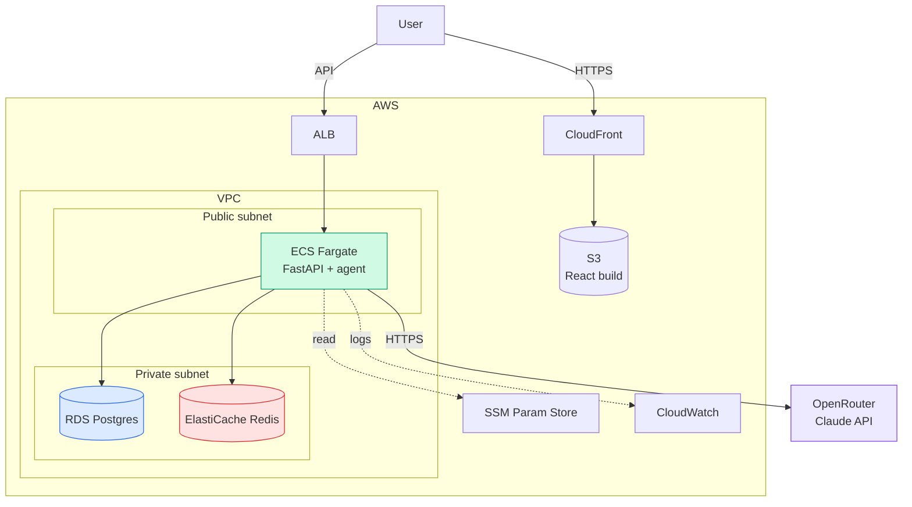
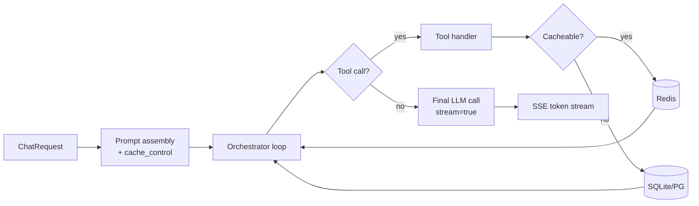
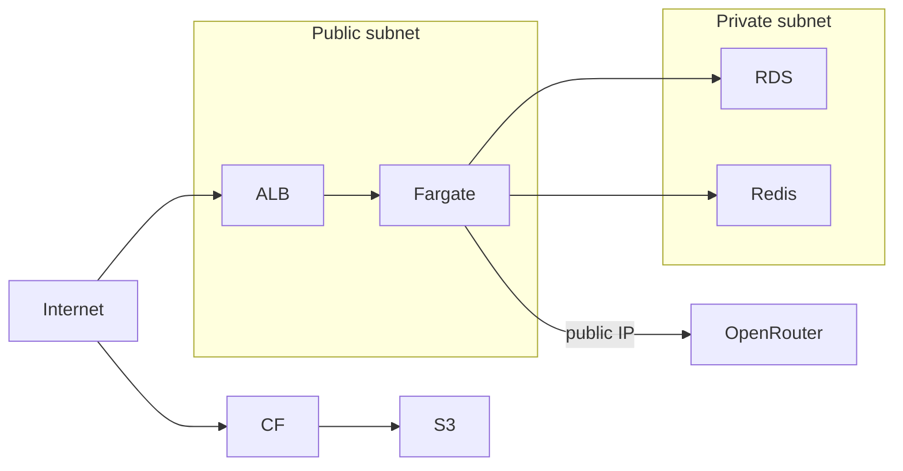
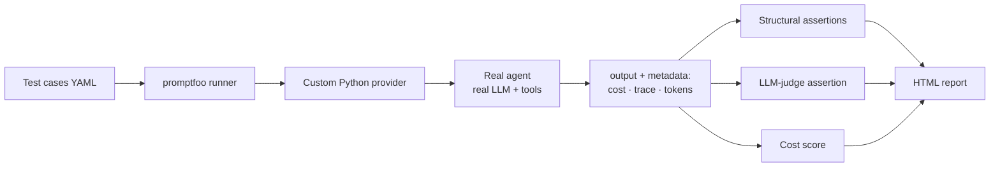

# Smart Grocery Assistant — Phase 3 Architecture Spec

**Date:** 2026-04-15 | **Status:** Draft | **Owner:** Dako (@iDako7)

---

## Context

Phase 2 ships a deployable app for local validation. Phase 3 brings it online for ~50 concurrent users.

**Goals:** perceived latency ↓ · output structure (token streaming) · production AWS deploy (~$65/mo) · parallel eval task.

**Non-goals (deferred):** multi-stage orchestration · intent router · parallel detail generation · model routing · semantic cache · auto-scaling · CI/CD.

---

## 1. System Overview

### 1.1 Architecture



### 1.2 Tech Stack

| Layer | Choice | Phase 3 Δ |
|---|---|---|
| Frontend hosting | S3 + CloudFront | new |
| API runtime | ECS Fargate (1 task, 0.5 vCPU, 1GB) | new |
| Load balancer | ALB | new |
| Mutable DB | RDS Postgres `db.t4g.micro` | managed |
| KB DB | SQLite (bundled in image) | — |
| Cache | ElastiCache Redis `cache.t4g.micro` | new |
| LLM | Claude via OpenRouter | — |
| Prompt caching | Anthropic `cache_control` | new |
| Streaming | SSE + token-level on final call | upgraded |
| Secrets | SSM Parameter Store | new |
| Logs | CloudWatch (Fargate default) | new |
| IaC | Terraform | new |
| Deploy | manual `terraform apply` + `ecs update-service` | new |
| Eval | promptfoo + custom Python provider | new |

### 1.3 Document Index

| § | Topic |
|---|---|
| 2 | AI layer optimizations |
| 3 | Deployment |
| 4 | Eval task |
| 5 | Cost summary |
| 6 | Migration notes |

---

## 2. AI Layer Optimizations



### 2.1 Prompt caching

| | |
|---|---|
| **What** | Mark system prompt + user profile + tool schemas with `cache_control: {type: "ephemeral"}` |
| **Saves** | ~50–80% TTFT · ~90% cost on cached tokens |
| **TTL** | ~5 min (covers full session loop) |
| **Risk** | Verify OpenRouter pass-through |

### 2.2 Tool output cache (Redis)

| Tool | Key | TTL |
|---|---|---|
| `analyze_pcsv` | `pcsv:{ingredients_hash}` | 24h |
| `search_recipes` | `recipes:{params_hash}` | 1h |
| `get_recipe_detail` | `recipe:{id}` | 24h |
| `get_substitutions` | `subs:{ingredient}:{reason}` | 24h |
| `lookup_store_product` | `product:{name}:{store}` | 24h |
| `translate_term` | `xlate:{term}:{direction}` | 7d |
| `update_user_profile` | — (write op, no cache) | — |

Pattern: `cached = redis.get(key); if not cached: cached = handler(); redis.setex(key, ttl, cached)`.

### 2.3 Token streaming

Phase 2 → Phase 3: collect-then-emit → token-streamed final call.

```
Loop runs           → tool events emitted as before
Final LLM call      → stream=True
Each chunk          → emit_sse_token(chunk.delta)
End                 → emit done
```

Orchestration structure unchanged · tool dispatch unchanged · only final response transport changes.

### 2.4 Chip pre-warming

| Chip | Storage key | Source |
|---|---|---|
| Weekend BBQ | `chip:bbq` | One-shot script at deploy |
| Weeknight meals | `chip:weeknight` | One-shot script at deploy |
| Use my leftovers | `chip:leftovers` | One-shot script at deploy |

Chip tap → instant Redis hit · first chat → full agent run with user profile.

---

## 3. Deployment

### 3.1 Network



| Resource | Subnet | Why |
|---|---|---|
| ALB | public | Internet ingress |
| Fargate | public + public IP | Outbound to OpenRouter without NAT |
| RDS | private | No internet exposure |
| Redis | private | No internet exposure |

NAT skipped (saves ~$32/mo) · Fargate inbound locked to ALB SG.

### 3.2 Compute & Data

| Resource | Spec |
|---|---|
| Fargate task | 0.5 vCPU · 1GB · desired=1 |
| RDS | `db.t4g.micro` · 20GB gp3 · single AZ |
| Redis | `cache.t4g.micro` · 1 node · no replication |
| S3 | Standard · public-read via CF OAC |
| CloudFront | Default cache · TLS via ACM |

### 3.3 Secrets · Logs · Deploy

| Concern | Mechanism |
|---|---|
| Secrets storage | SSM Parameter Store (SecureString) |
| Secrets injection | ECS task def `secrets` block → env vars |
| Secrets in scope | `OPENROUTER_API_KEY` · `JWT_SECRET` · `DATABASE_URL` · `REDIS_URL` |
| Logs | CloudWatch (Fargate default driver) |
| Image registry | ECR (private) |
| Deploy | `docker build → ecr push → terraform apply → aws ecs update-service --force-new-deployment` |

---

## 4. Eval Task (Parallel Workstream)



### 4.1 Components

| Component | Responsibility |
|---|---|
| Test case dataset | YAML · ~30–50 cases (count deferred) · journeys + dietary + edge |
| Custom provider | `provider.py` wraps `run_agent()` → `{output, metadata: {cost_usd, tokens, tool_calls}}` |
| Structural assertions | Pydantic-validated · card count 3–5 · dietary compliance · PCSV gap addressed |
| LLM-judge | Separate Sonnet call · rubric: variety · coherence · taste |
| Cost score | Threshold check on `metadata.cost_usd` |
| Cost computation | Token counts × hardcoded price table (versioned in repo) |

### 4.2 Cadence

Manual run before significant prompt or tool changes · not in CI (real LLM cost · ~15min wall time per suite).

---

## 5. Cost Summary

| Service | Monthly |
|---|---|
| Fargate (1 task, always on) | $18 |
| ALB | $16 |
| RDS `db.t4g.micro` | $12 |
| ElastiCache `cache.t4g.micro` | $12 |
| S3 + CloudFront | $2 |
| Data transfer | $5 |
| SSM · CloudWatch · ECR | ~$0 (free tier) |
| **Total** | **~$65/mo** |

OpenRouter cost is usage-driven · tracked per-session via eval task.

---

## 6. Migration Notes

What survives a future API ↔ AI worker microservice split:

| Component | Survives | Notes |
|---|---|---|
| FastAPI structure | yes | Split boundary = orchestrator import |
| Pydantic contracts | yes | Already shared via `contracts/` |
| Redis | yes | Becomes shared cache across services |
| RDS | yes | Shared by both services initially |
| SQLite KB | yes | Bundled in AI worker image |
| Prompt caching | yes | Per-call concern, location-agnostic |
| Token streaming | yes | AI worker streams to API which proxies |
| ECS task def | partial | Becomes 2 task definitions, same VPC/ALB |

---

## Modification History

| Date | Version | Changes |
|---|---|---|
| 2026-04-15 | v1 | Initial Phase 3 architecture: prompt caching · Redis tool cache · token streaming · chip pre-warming · ECS Fargate + ALB + RDS + ElastiCache + S3/CF · promptfoo eval with cost-as-score |
