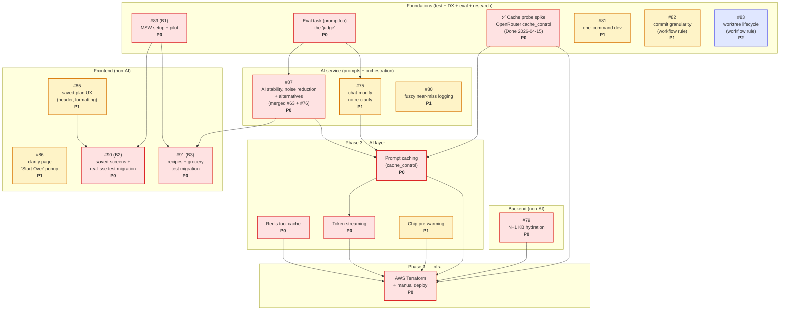

# Phase 3 Prep — Dependency Map

**Date:** 2026-04-15 | **Status:** Draft | **Owner:** Dako (@iDako7)

Dependency view of the cleanup + Phase 3 deploy work. Replaces stage-based thinking — tasks are grouped by **what they touch**, edges show **what must land first**.

---

## Dependency graph



---

## Independent tasks (no dependencies, can start anytime)

| Task | Priority | Notes |
|---|---|---|
| **Eval task (promptfoo) — the "judge"** | **P0** | **Promoted from P1.** Recommend to exist *before* any AI prompt/orchestration changes — you can't fix fluctuating dish counts (#76) or ingredient noise (#63) reliably by hand. Automated cost + quality scores across 20+ test cases are the only way to prove prompt changes actually work. Lives in `evals/`, independent of all code paths. |
| **✅ Cache probe spike** | **DONE** | **Resolved 2026-04-15.** OpenRouter correctly passes through `cache_control` headers with 0.1x cost multiplier. Evidence in `docs/02-notes/cache-probe-results.md`. |
| #89 (B1) MSW setup + pilot | P0 | Blocker for B2 + B3, but itself has no prerequisites |
| #79 N+1 KB hydration | P0 | Pure backend, isolated to `src/backend/api/sessions.py:204-214` |
| #85 saved-plan UX (header, formatting) | P1 | Pure frontend, no backend/AI coupling. Split from original #78. |
| #86 clarify page 'Start Over' popup | P1 | Pure frontend, isolated to clarify screen. Split from original #78. |
| #87 AI stability + noise reduction + alternatives | P0 | AI service only. Merges original #63 + #76. **Requires eval task in place first.** |
| #75 chat-modify no re-clarify | **P1** | **Promoted from P2.** Must land before prompt caching freezes prompt shape — fixing after means rewriting instructions and redoing cache setup. |
| #80 fuzzy near-miss logging | P1 | Isolated to `src/ai/tools/lookup_store_product.py`, one file |
| #81 one-command dev | P1 | Root `package.json` + `docker-compose.yml` only |
| #82 commit granularity | P1 | Workflow rule — CLAUDE.md edit, not code |
| #83 worktree lifecycle | P2 | Workflow rule — CLAUDE.md + optional cleanup script |
| Phase 3: Redis tool cache | P0 | Isolated tool-handler wrapping |
| Phase 3: Chip pre-warming | P1 | Standalone script + deploy hook |

---

## Dependency chains (what blocks what)

### Chain A — Test foundation
```
#89 (B1) ──> #90 (B2)
#89 (B1) ──> #91 (B3)
```
MSW infrastructure must exist before any screen-level test migration.

### Chain B — Frontend UX → test
```
#85 ──> #90 (B2)
```
Migrate saved-screens tests *after* #85 lands, otherwise you rewrite the same tests twice. (#86 popup is isolated to the clarify screen and has no test-migration dependency.)

### Chain C — AI fixes → their test migration
```
#87 ──> #91 (B3)
```
Recipes screen changes in #87 (restructuring into "main dish + alternatives"). Migrating tests *before* that data-structure change lands means rewriting them twice — serialize them.

### Chain D — AI fixes → prompt caching (the "freeze")
```
#87 ──> Phase 3 prompt caching
#75 ──> Phase 3 prompt caching
```
**Critical:** prompt caching freezes system prompt shape via `cache_control` breakpoints. Any prompt/orchestration change *after* caching lands invalidates the cache strategy and forces rework. Ship both AI-layer behavior fixes first — this is why #75 was promoted from P2 to P1.

### Chain G — Eval task is the "judge" for all AI changes
```
Eval task ──> #87
Eval task ──> #75
```
You cannot reliably fix fluctuating dish counts or ingredient noise by hand. The eval suite with cost + quality scores across 20+ test cases is the only way to *prove* a prompt change is an improvement rather than a regression. Build the judge before trying the fix. This is why eval was promoted from P1 to P0 and moved into Foundations.

### Chain H — Cache probe gates Phase 3 design (Resolved)
```
✅ Cache probe spike ──> Phase 3 prompt caching
✅ Cache probe spike ──> AWS Terraform deploy
```
**Resolved 2026-04-15:** OpenRouter successfully passes `cache_control` headers. Caching assumptions and Phase 3 cost model are validated. No pivot required.

### Chain E — Phase 3 AI-layer serialization
```
Prompt caching ──> Token streaming
```
Both touch the final LLM call site. Serialize within the AI layer.

### Chain F — Everything → deploy
```
All Phase 3 AI work  ──┐
#79 N+1 hydration    ──┼──> AWS Terraform deploy
                       ┘
```
Backend perf fix and all AI-layer optimizations must land before the deploy goes live, so production starts on a clean baseline.

---

## Pre-execution: issue hygiene pass ✅ done 2026-04-15

Before any task on the map is picked up, run a one-time issue hygiene pass. **Priority: P1, ~1 hour.** Rationale: wide-scope issues break PR-to-issue traceability, hide scope creep, and block parallelization (a teammate can't cleanly take "half of #78").

**Execution outcome:**
- #78 split → **#85** (saved-plan UX header/formatting) + **#86** (clarify page 'Start Over' popup). Original #78 closed.
- #63 + #76 merged → **#87** (AI stability, noise reduction, and alternatives). Originals closed.
- #84 converted to parent/tracking issue. Sub-issues created and natively linked: **#89** (B1 setup+pilot), **#90** (B2 saved-screens+real-sse), **#91** (B3 recipes+grocery+PR #74 regression). Parent body rewritten as concise tracker preserving the "assert visible DOM, not props" review rule.

### Two problem patterns

1. **Wide-scope issues** — one issue covers multiple independent sub-tasks on different pages/files. Should be split into per-PR issues; original closed.
2. **Multi-PR issues** — one issue is a roadmap of 2+ PRs. Should become a **parent issue** with GitHub native sub-issues, each sub-issue linked to its PR.

### Concrete actions

| Current issue | Problem | Proposed action |
|---|---|---|
| **#78** saved-plan + clarify popup | Wide scope — bundles saved-plan UX (header, instruction formatting) *and* clarify/recipes popup placement. Two different pages, two different PRs. | Split into **#78a** (saved-plan UX) + **#78b** (clarify popup placement). Close #78 with links to successors. |
| **#84** MSW test refactor | Multi-PR — tracked as one issue but scoped as 3 PRs (B1 setup+pilot, B2 saved-screens+real-sse, B3 recipes+grocery). | Convert #84 to **parent issue**. Create sub-issues **#84.1**, **#84.2**, **#84.3** via GitHub native sub-issue feature. Each sub-issue links to its PR. |
| **#63 + #76** ingredient noise + dish count | Inverse problem — two issues that should be one. Same files (`src/ai/prompts/*`, orchestrator), same root cause (prompt structure discipline). | Merge — one issue absorbs the other (e.g., #76 absorbs #63), add a cross-link comment on the closed one. |

### Acceptance

- [ ] #78 split, original closed, successors referenced in dependency map
- [ ] #84 converted to parent with 3 sub-issues, each linked to its future PR
- [ ] #63 or #76 closed as duplicate, remaining issue retitled to cover both concerns
- [ ] Dependency map updated to use new issue numbers
- [ ] All new/merged issues carry the same P0/P1/P2 priority as the originals

### Why this is P1 (not P0)

Skipping it doesn't block deploy, but every day of execution without it compounds the traceability debt. Do it *once*, at the start, before any PR links back to the old issue numbers.

---

## Sharp edges

1. **Eval first, AI fixes second.** The eval task is the "judge" — you can't reliably prove #63/#76/#75 improvements without it. Do not start prompt work until the eval suite runs end-to-end on the current prompts as a baseline.
2. **Cache probe is a go/no-go gate.** If OpenRouter strips `cache_control`, the Phase 3 cost model and prompt caching design both break. Resolve in ~1 hour before touching Terraform.
3. **#87 is the merged AI fix.** Original #63 + #76 were merged — same prompt/orchestrator files, same root cause.
4. **#91 (B3) is the last test migration**, not first. It depends on #87 finalizing the recipe data structure (main dish + alternatives).
5. **#75 is now a prompt-caching blocker.** Promoted from P2 to P1 because fixing it *after* caching means rewriting instructions and redoing cache setup.
6. **Terraform (P3TF) can scaffold in parallel** with AI-layer work — infra lives in its own directory, zero code overlap — but *deployment* cannot begin until the cache probe resolves.
7. **#80 near-miss logging** is P1 only because its *value* materializes after 1–2 weeks of production traffic. Land it before deploy if possible so data collection starts on day 1.

---

## Priority legend

- **P0 (12):** Blocks deploy or compounds tech debt if skipped.
- **P1 (6):** Ships noticeably worse product without it, but not a release blocker.
- **P2 (1):** Deferrable without regret.

---

## Modification History

| Date | Version | Changes |
|---|---|---|
| 2026-04-15 | v1 | Initial dependency map for Phase 3 cleanup + deploy sequencing |
| 2026-04-15 | v2 | Promoted eval task to P0 (the "judge" must exist before AI fixes) · added P0 cache probe spike (OpenRouter `cache_control` pass-through gate) · promoted #75 to P1 as prompt-caching blocker · added Chain G (eval→AI) and Chain H (cache probe→Phase 3) |
| 2026-04-15 | v3 | Issue hygiene executed: #78 split into #85 (saved-plan UX) + #86 (clarify popup) · #63 and #76 merged into #87 (AI stability + alternatives) · all edges and chains updated to new issue numbers |
| 2026-04-15 | v4 | Marked Cache probe spike as DONE (OpenRouter `cache_control` validated) |
