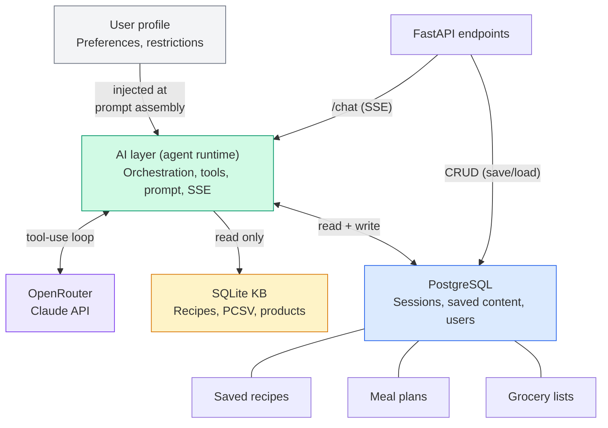
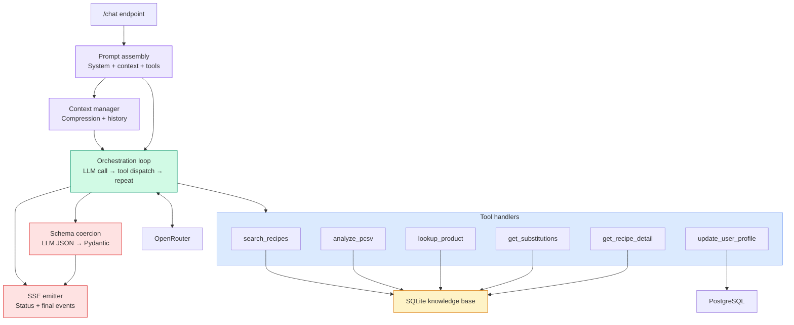

# Smart Grocery Assistant — AI Layer Architecture

**Date:** 2026-04-05 | **Status:** Active | **Owner:** Dako (@iDako7)

---

## 1. Overview

The AI layer is the intelligence core of the Smart Grocery Assistant. It receives user messages, orchestrates LLM reasoning with tool-use, and streams structured results back to the frontend. This document covers its internal architecture, its interactions with surrounding systems, and the reasoning behind each design decision.

---

## 2. System Context — AI Layer and Surrounding Systems

The AI layer sits between the FastAPI endpoints and two data stores, with OpenRouter as the external LLM provider. CRUD operations for saved content bypass the AI layer entirely.

**Key relationships:**

- **`/chat` (SSE):** The only path through the AI layer. All LLM interactions — screen transitions, chat corrections, swap requests — flow through this endpoint.
- **CRUD (save/load):** Saved content management is direct FastAPI-to-PostgreSQL. No LLM involvement. These endpoints share Pydantic models with the AI layer (e.g., `RecipeCard`, `GroceryList`) but are otherwise independent.
- **SQLite KB:** Read-only at runtime. Tool handlers query it for recipes, PCSV mappings, store products, and substitutions.
- **PostgreSQL:** Mutable store for sessions (conversation turns), saved content (meal plans, recipes, grocery lists), user profiles, and auth.
- **User profile:** Read from PostgreSQL at prompt assembly time (every `/chat` call). Updated via the `update_user_profile` tool during conversation.

---

## 3. AI Layer Internals

Six components connected in a pipeline from incoming request to outgoing SSE stream.

**Component responsibilities:**

- **Prompt assembly** composes the full LLM payload: persona snippet + rules snippet + tool instruction snippet + user profile (from PostgreSQL) + compressed history (from context manager).
- **Context manager** owns conversation state. Stores full turn history and runs `build_context()` to compress old turns into a summary before each call, bounding token costs.
- **Orchestration loop** is the core runtime. Sends assembled prompt to OpenRouter, inspects response for `tool_use` blocks, dispatches to the right handler, appends tool results, and loops until the LLM returns a final text response. Emits `thinking` status events during the loop.
- **Schema coercion** takes the LLM's loosely-structured JSON output and validates it through a Pydantic model hierarchy. Handles type coercion, semantic synonyms, and defaults. Re-prompts only as a last resort for structurally broken output.
- **SSE emitter** sends typed events to the frontend. During the loop: `thinking` events (status strings). After the loop: `pcsv_update`, `recipe_card`, `explanation`, `grocery_list`, `done` events in rapid sequence.
- **Tool handlers** are six pure functions. Each receives typed params, executes a query (SQL against SQLite, or PostgreSQL for user profile), and returns typed results. No LLM logic, no side effects.

---

## 4. Architecture Decision Records

### ADR-1: Single orchestration loop over framework abstraction

**Decision:** Build the tool-use orchestration as an explicit while-loop, not a framework like LangChain or LangGraph.

**Context:** The agent calls OpenRouter, inspects responses for tool-use blocks, dispatches tool handlers, and loops. This is ~40 lines of code. Frameworks abstract this loop but add dependency weight.

**Why:** Full control over when status events fire, how many iterations are allowed, and what happens on partial failure. At this scale (one agent, five tools), the framework overhead exceeds the problem complexity. OpenRouter compatibility with framework abstractions is also unverified.

**Alternatives considered:**
- *LangChain/LangGraph agent executor* — handles the loop but adds a heavy dependency. Time spent learning its abstractions would exceed time writing the loop.
- *Anthropic tool-use SDK* — cleaner, but going through OpenRouter, not direct Anthropic API, so SDK compatibility isn't guaranteed.

**Risk:** LLM could loop infinitely. Mitigated with `max_iterations = 10`. If hit, return whatever partial results exist with `done: "partial"`.

---

### ADR-2: Collect-then-emit over progressive streaming (Phase 2)

**Decision:** The orchestration loop runs to completion, then emits all SSE events in rapid sequence. During the loop, only simple `thinking` status strings are streamed.

**Context:** The full tool-use loop takes 5–15 seconds. Users need feedback that the system is working. Two approaches exist: (a) emit typed events during the loop as each tool completes (progressive), or (b) emit status strings during the loop and typed events after completion (collect-then-emit).

**Why:** Collect-then-emit keeps the orchestration loop clean — tool execution is separated from event emission. The frontend doesn't need to handle partial state (e.g., recipe cards arriving one at a time while the agent is still reasoning). Status messages ("Analyzing your ingredients…", "Searching recipes…") are sufficient feedback for Phase 2 validation.

**Alternatives considered:**
- *Progressive streaming* — emits `pcsv_update` and `recipe_card` events inside the loop as each tool completes. Better UX but interleaves orchestration with streaming logic. Planned as a Phase 3 upgrade.

**Upgrade path:** The two approaches share identical SSE event types, tool handlers, and orchestration structure. Upgrading to progressive streaming means moving `emit_sse()` calls from after the loop to inside it — a localized change, not a rebuild.

**Risk:** 10+ second wait with only status strings may feel slow. Mitigated by emitting a new status on each tool call start, giving the user a sense of progress through the pipeline.

---

### ADR-3: Structured user profile over RAG-based memory

**Decision:** Use a compact, structured user profile document (Pydantic model stored in PostgreSQL) injected into every system prompt. No vector search, no conversation history retrieval.

**Context:** The agent needs cross-session knowledge: dietary restrictions, preferred cuisines, disliked ingredients, shopping patterns. Three approaches exist for LLM agent memory: conversation window, RAG over history, or structured profile.

**Why:** The relevant user knowledge in the grocery domain is small (~500 tokens) and slowly-changing. A structured profile fits entirely in the system prompt without retrieval overhead. It's deterministic — the agent always sees the same profile, no retrieval quality variance. It also decouples the memory schema (what the agent reads) from the memory writer (what populates it), enabling a clean Phase 2 → Phase 3 evolution.

**Alternatives considered:**
- *Conversation window (last N turns)* — simple but lossy. Preferences mentioned 20 sessions ago are gone. Used within a single session (context manager), but insufficient cross-session.
- *RAG over history* — stores all past conversations, embeds them, retrieves relevant chunks. Unpredictable retrieval quality, higher cost, returns verbose raw conversation instead of distilled facts.
- *Hybrid (profile + episodic RAG)* — structured profile for stable knowledge, RAG for episodic queries ("what did I cook last Thanksgiving?"). Only warranted if usage data shows episodic recall matters.

**Phase 2 implementation:** Define profile schema. Agent updates it via `update_user_profile` tool during conversation. Full profile injected at prompt assembly time.

**Phase 3 evolution:** Add an automated writer — background process or session-end hook that extracts new facts from completed conversations and merges them into the profile. The profile schema and read path remain unchanged.

**Risk:** Profile could grow unbounded if `notes` field accumulates without curation. Mitigate with a size cap and periodic summarization.

---

### ADR-4: Two databases by access pattern

**Decision:** SQLite for the read-only knowledge base (recipes, PCSV mappings, store products, substitutions). PostgreSQL for mutable data (sessions, saved content, user profiles, auth).

**Context:** The system has two fundamentally different data access patterns: a curated reference dataset that changes only at deployment time, and user-generated data that changes on every interaction.

**Why:** SQLite is simpler to seed, version, and deploy as a single file bundled with the application. It requires no server process, no connection pooling, and no migrations for reference data updates — ship a new `.db` file. PostgreSQL handles the mutable side: concurrent writes from multiple users, transactional integrity for session management, and relational queries across saved content.

**Alternatives considered:**
- *PostgreSQL for everything* — simpler operationally (one database), but forces the KB through connection pooling and makes it harder to version or ship as a file. KB updates require migrations instead of file replacement.
- *SQLite for everything* — can't handle concurrent writes from multiple users in a web application. Single-writer lock would serialize all session updates.

**Risk:** Two databases add operational complexity. Mitigated by keeping SQLite truly read-only at runtime (no writes, no WAL mode needed) and bundling it in the Docker image.

---

### ADR-5: Six tools, LLM-controlled sequencing

**Decision:** Five KB query tools plus one profile update tool. The LLM decides which tools to call, in what order, and how many times. No hardcoded call sequence.

**Context:** V1 used six separate REST endpoints with a hardcoded client-orchestrated sequence. V2 replaces this with tool-use, where the LLM decides the workflow per conversation.

**Why:** Different user inputs require different tool sequences. "BBQ for 8" needs `analyze_pcsv` → `search_recipes` → `lookup_store_product`. "What can I substitute for gochujang?" needs only `get_substitutions`. Hardcoding sequences forces every input through the same pipeline; tool-use lets the agent adapt.

**Tools:**

| Tool | Purpose | Data source |
|---|---|---|
| `analyze_pcsv` | Categorize ingredients by Protein/Carb/Veggie/Sauce | SQLite (PCSV mappings) |
| `search_recipes` | Find recipes matching ingredients and constraints | SQLite (recipes) |
| `lookup_store_product` | Get package sizes, departments, store availability | SQLite (products) |
| `get_substitutions` | Find ingredient alternatives by reason | SQLite (substitutions) |
| `get_recipe_detail` | Fetch full cooking instructions for a recipe | SQLite (recipes) |
| `update_user_profile` | Persist learned preferences/restrictions | PostgreSQL (users) |

**Design notes:**
- No `generate_recipe` tool — when KB has no match, the LLM falls back to generation in its response text, flagged as "AI-suggested."
- No `get_user_history` tool — fridge recall (OQ-1) is deferred. Adding it later is a clean extension: new tool + new table.
- If Phase 1 testing shows the LLM struggles with 6 tools, merge `get_substitutions` into `search_recipes` as an optional flag.

**Risk:** LLM may call tools unnecessarily or in suboptimal order. Mitigated by tool instructions in the system prompt specifying preferred sequences (e.g., "always call `analyze_pcsv` before `search_recipes`").

---

### ADR-6: Schema coercion hierarchy over re-prompting

**Decision:** Parse LLM output through a multi-step coercion pipeline. Re-prompt only as a last resort for structurally broken JSON.

**Context:** LLMs produce loosely-structured JSON — wrong casing on booleans, strings instead of integers, missing optional fields. Each re-prompt costs 2–5 seconds of latency and doubles token cost.

**Coercion hierarchy:**

1. `json.loads()` — handles 95% of cases (lowercase true/false/null)
2. Pydantic type coercion — string "3" → int 3, "true" → bool True
3. Field validators — semantic synonyms ("good" → "ok" for status fields)
4. Default values — missing optional fields get None
5. Re-prompt — last resort, only for structurally broken output (<1% with good prompts)

**Why:** Each step is cheaper than re-prompting. Steps 1–4 add milliseconds. Re-prompting adds seconds. The coercion pipeline handles the long tail of LLM formatting inconsistencies without round-trip cost.

**Risk:** Over-permissive coercion could mask real output errors. Mitigate by logging coercion actions for monitoring — if a specific coercion fires frequently, fix the prompt instead.

---

### ADR-7: SSE over WebSocket and polling

**Decision:** Server-Sent Events for the `/chat` endpoint response stream.

**Context:** The tool-use loop takes 5–15 seconds. The frontend needs incremental updates during this window. Three transport options: SSE, WebSocket, polling.

**Why:** SSE is unidirectional (server → client), which matches the data flow exactly. The client sends via POST, the server streams back. No connection upgrade negotiation. Native browser `EventSource` API. Works through most proxies and CDNs without special configuration.

**Alternatives considered:**
- *WebSocket* — bidirectional, but the client only sends via POST (new messages). The duplex channel adds connection management complexity (heartbeat, reconnection) for no benefit.
- *Polling* — at what interval? Too frequent wastes requests during idle periods. Too infrequent misses status updates during 5–15 second tool-use loops. Polling is fundamentally the wrong model for a stream of typed events.

**Risk:** SSE connections are long-lived. Server must handle connection drops gracefully. The `done` event carries a status field (`"complete"` | `"partial"`) so the frontend knows whether to show a retry prompt.

---

## 5. Phase Alignment

| Component | Phase 1 (Prove) | Phase 2 (Ship) | Phase 3 (Optimize) |
|---|---|---|---|
| Orchestration loop | Claude artifact, manual testing | FastAPI, explicit while-loop | Parallel tool dispatch |
| Prompt assembly | Inline system prompt | Skill file concatenation | A/B testing prompts |
| Context manager | Not needed (single-turn) | Simple truncation (last N turns + summary) | LLM-generated compression |
| Tool handlers | Mock data in tool responses | SQLite queries | Vector reranking |
| Schema coercion | Manual JSON inspection | Pydantic pipeline | Monitoring + prompt fixes |
| SSE emitter | Not needed | Collect-then-emit with status strings | Progressive streaming |
| User profile | Not needed | Agent self-write via tool | Automated extraction pipeline |

---

## 6. Open Questions

- **OQ-1:** Fridge recall mechanism — how aggressively to prompt based on purchase history. Deferred to prototyping.
- **OQ-2:** KB seed strategy — which recipes and products to index first. Deferred until source data is available.
- **OQ-3:** Model selection — depends on Phase 1 evaluation with real conversations.
- **OQ-4:** Extremely vague input threshold — minimum information before useful suggestions. Deferred to user testing.
- **OQ-5:** KB schema design — deferred until source data (Kenji's books, store product lists) is in hand.

---

## References

- **Product spec:** `product-spec-v2.md`
- **Architecture spec:** `architecture-spec-v2.md`
- **Implementation plan:** `Smart_Grocery_Assistant_V2_Implementation_Plan.md`
- **AI layer contracts:** `ai-layer-contracts-v2.md`
- **Wireframe:** `wireframe-v2.html`
- **Agent patterns:** [Anthropic — Building Effective Agents](https://www.anthropic.com/research/building-effective-agents)
- **Tool design:** [Anthropic — Writing Effective Tools for Agents](https://www.anthropic.com/engineering/writing-tools-for-agents)
