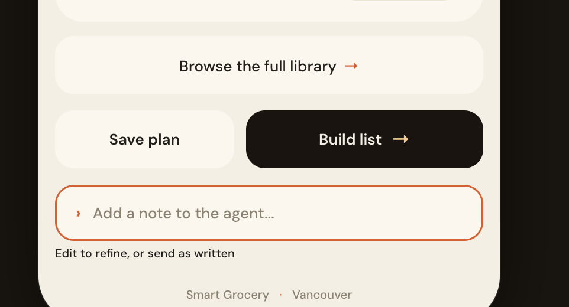

<!-- this is the human comment on the file  SGA_V2-wt3-frontend/src/frontend/static-preview.html -->

## clarify page

1. The size of the page title is too big
2. The clarify part occupies too much unnecessary space -- We should only use one or two line to present the PCV analysis
3. There is no clarify question presented in this page
4. Looks good button is too huge

## recipe page

1.there is an extra unnecessary button

2. What is browse the full library button?
3. The button on the button are too many and too big
   

## Grocery and saved list

1. missing aisle view -- maybe we could add tag to item and allow user to sort by tag, therefore it's easy to implement and still workable for user
