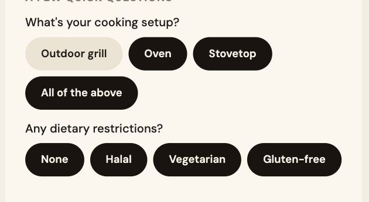
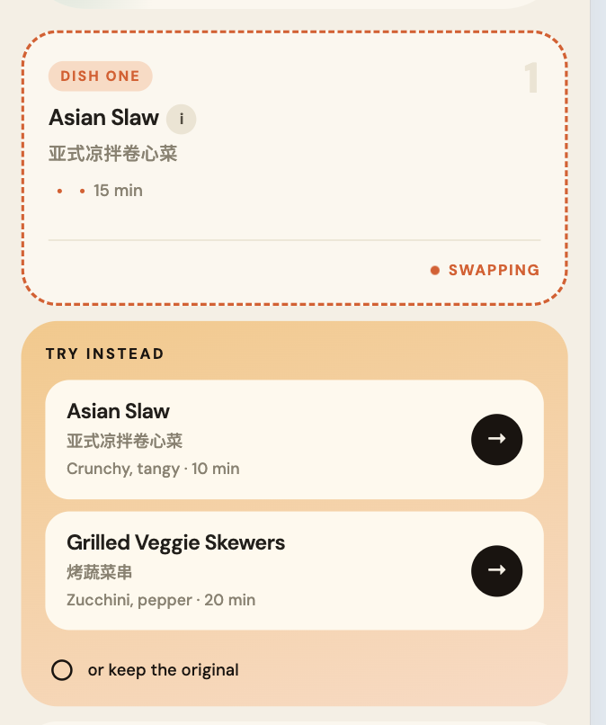

<!--
question: the front end has hundreds of tests, still there are some critical issue in interface interaction,
help me find out reason and what approach we should use in following development -- to let the agent prevent these issues instead of rely on manually checking

few approach I am thinking and want to discuss with you:
1. it seems the front end agent rigidly follows the html prototype, which isn't fully correct. if so, maybe we could let an agent write a feature list directly based on architecture spec and product spec, to use it as reference to write integration test or agent self verification using chrome dev tool
2. should we fix all these issue and test with mock data, or should we directly using backend to test? since the backend is ready, go stage 4 directly?
 -->

## clarify page

1. after clicking all above, the rest buttons won't be automatically selected; in reverse, if I unselected one button, the all of the above
2. similar issue exists to question "any dietary restrictions"

! a much worthy thinking problem: the option is generated by backend, so can front end decide when to present "None" and when to present "All of the above"

## recipe page

**actual result**

1. by default, the 1st card present Korean BBQ
2. click try another button --> select Asian Slaw
3. click try another button --> the list still present Asian Slaw

**anticipate result**

1. after selecting Asian Slaw, the alternative list should present Korean BBQ and the other item -- basically, when user select one item, it should switch place with the item in the selected area

## many button is unfunctional

1. recipe page: save plan button, EN·中
2. grocery page: save list
