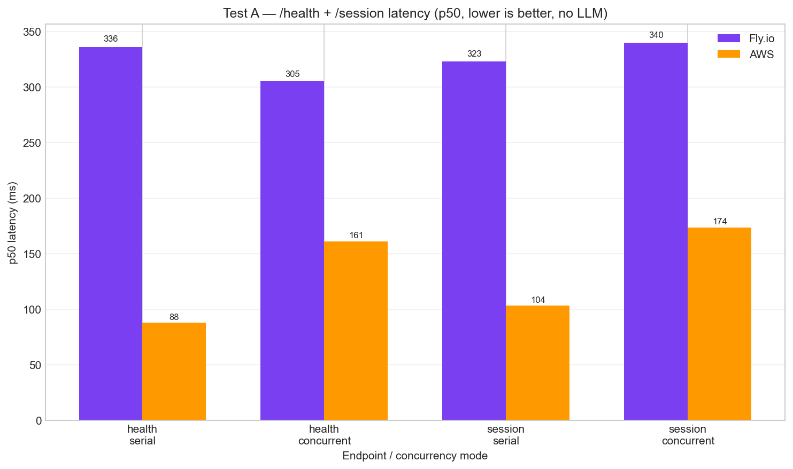
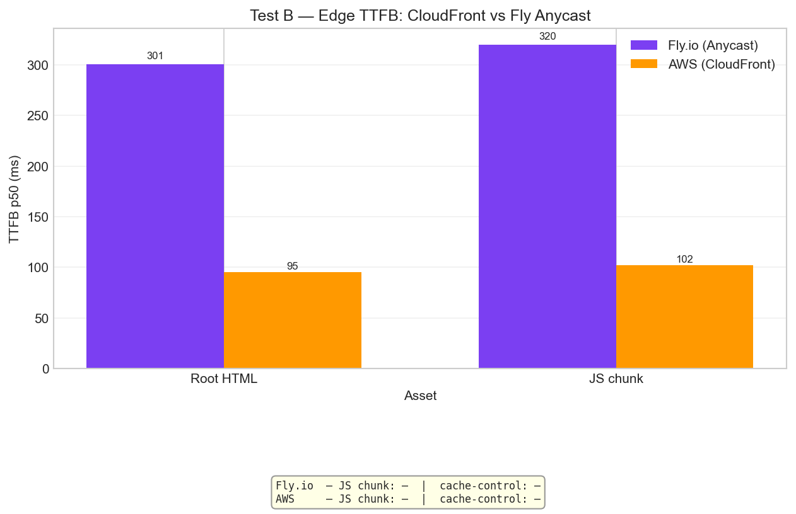
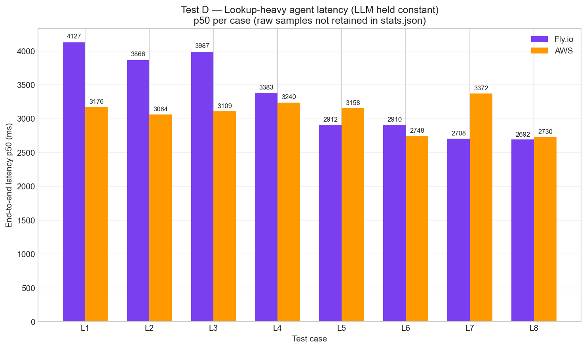
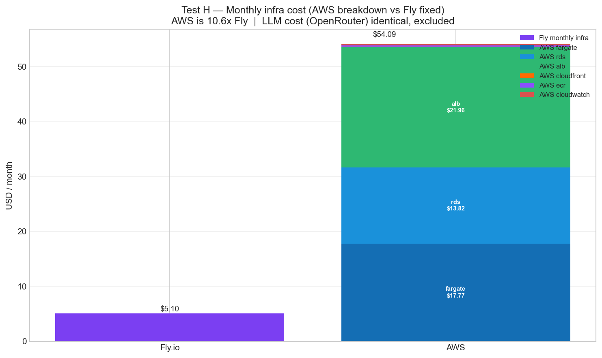

# SGA V2 — Infrastructure Comparison: Fly.io vs AWS

_Fly.io (`sga-v2.fly.dev`) vs AWS (`d33hdkvctxckhb.cloudfront.net`) infrastructure showdown. Generated 2026-04-19. Branch: `eval/infra-comparison`._

> **System under test:** Smart Grocery Assistant V2 — FastAPI + React SPA + 7-tool Claude agent. Both platforms run the **same model** (`openai/gpt-5.4-mini` via OpenRouter) and the **same code** (PR #147, main). This evaluation isolates infrastructure performance and cost — not model quality.

---

## 1. What was tested and why

Full agent runs are dominated by LLM round-trips (~2–3 s via OpenRouter), which would mask any infrastructure difference. The test bundle is designed to isolate the infra signal: **pure-HTTP microbenchmarks** (no LLM), **edge TTFB** (static asset delivery), **lookup-heavy agent cases** (DB-heavy paths that surface infra signal in the tail), and a **cost model** built from Terraform config + public list prices.

| Test | Name | What it measures | LLM? |
|------|------|-----------------|------|
| **A** | HTTP Microbenchmark | `GET /health` (no DB) and `POST /session` (Postgres write) — serial and 10-concurrent phases | No |
| **B** | TTFB Static Assets | Root HTML and largest hashed JS chunk via CloudFront vs Fly Anycast | No |
| **D** | Lookup-Heavy Agent | 8 cases targeting `translate_term`, `analyze_pcsv`, `get_substitutions`, `lookup_store_product` — 2 runs per platform | Yes (held constant) |
| **H** | Monthly Cost Model | Fly flat rate vs AWS itemised (Fargate, RDS, ALB, CloudFront, ECR, CloudWatch) | No |

**Tests dropped from original plan:**

| Test | Reason dropped |
|------|---------------|
| **C** — Cold start | AWS runs `desired_count=1` (always-warm, no cold-start event). Fly's ~8 s wake penalty is already documented in `evals/presentation/REPORT.md`. Measuring only one side is not a controlled comparison. |
| **E** — Throughput knee | Both platforms share identical SQLAlchemy pool defaults (`pool_size=5`, `max_overflow=10`). Running 20 concurrent users against AWS would wedge RDS the same way it wedged Fly — same bottleneck, same config, nothing new to learn. |

---

## 2. System topology

Two different stacks, one model, one codebase. The key architectural gap: Fly is a single-layer PaaS (Anycast edge + compute colocated, Postgres managed in the same region), while AWS layers CloudFront → ALB → Fargate → RDS across separate managed services.

**Fly.io**
```
Client (YVR)
    │
    ▼ Fly Anycast (TLS at nearest PoP, ~sjc)
    │
    ▼ Fly Machine — shared-cpu-1x, 1 vCPU, 1 GB, amd64
      FastAPI (uvicorn) — SGA_AUTH_MODE=prod
    │
    ├──▶ Fly Postgres (sjc) — pool_size=5 / max_overflow=10
    └──▶ OpenRouter → openai/gpt-5.4-mini
```

**AWS (us-west-2)**
```
Client (YVR)
    │
    ▼ CloudFront PriceClass_100 (CachingDisabled for SSE, compression=off)
    │
    ▼ Application Load Balancer (us-west-2)
    │
    ▼ ECS Fargate — 0.5 vCPU, 1 GB, ARM64 Graviton (always-warm, desired_count=1)
      FastAPI (uvicorn) — SGA_AUTH_MODE=dev (unset default)
    │
    ├──▶ RDS PostgreSQL 16.13 db.t4g.micro (us-west-2) — pool_size=5 / max_overflow=10
    └──▶ OpenRouter → openai/gpt-5.4-mini
```

**Three notable divergences** (from `data/preflight.json`):

| Divergence | Fly | AWS | Impact |
|---|---|---|---|
| **Auth mode** | `prod` | `dev` (unset default) | `/internal/reset-dev-profile` not mounted on Fly in prod mode; mitigated by `SGA_EVAL_RESET_PROFILE=0` for Test D — latency measurement is unaffected |
| **CPU architecture** | amd64 | ARM64 Graviton | Real architectural divergence; ARM64 was chosen for AWS in PR #147 because Tailwind v4 oxide amd64 binary produced broken CSS. May partly explain compute-layer differences |
| **Cold start** | ~8 s after idle (`auto_stop_machines=true`) | None (`desired_count=1`, always-warm) | Fly pays zero cost at idle and accepts an 8 s first-wake penalty; AWS pays ~$17–18/mo for Fargate regardless of traffic |

---

## 3. Test A: HTTP Microbenchmark

> _200 serial requests, then 200 concurrent requests (10 workers) per endpoint per platform. No LLM involved. Measures pure-infra round-trip: edge → compute, plus one Postgres write for `/session`._



| Endpoint | Phase | Fly p50 (ms) | Fly p95 (ms) | AWS p50 (ms) | AWS p95 (ms) | Fly/AWS ratio |
|----------|-------|-------------:|-------------:|-------------:|-------------:|-------------:|
| `GET /health` | Serial | 336.3 | 524.3 | 88.3 | 99.6 | **3.81×** |
| `GET /health` | Concurrent (10) | 305.2 | 394.1 | 161.3 | 314.4 | **1.89×** |
| `POST /session` | Serial | 323.2 | 540.3 | 103.7 | 116.5 | **3.12×** |
| `POST /session` | Concurrent (10) | 339.8 | 597.6 | 173.6 | 409.0 | **1.96×** |

**Headline: AWS is 3.8× faster on `/health` serial and 3.1× faster on `/session` serial.**

The concurrency story is subtler. Fly's p50 actually *improves* slightly under 10 concurrent users (336 ms → 305 ms) — likely a warm-up effect, as the first serial requests encounter a not-yet-JIT-compiled path or connection-pool setup. AWS, by contrast, degrades from 88 ms to 161 ms (+83 %) under the same load. This likely reflects CloudFront → ALB coalescing overhead or an extra hop in the routing path. AWS still wins in absolute terms at every percentile, but the serial-to-concurrent degradation ratio favors Fly.

The p95 spread tells the same story: Fly's p95 under concurrent load (394 ms) is actually tighter than AWS (314 ms) relative to their respective p50s. Fly's tail is more predictable once it's warm.

---

## 4. Test B: TTFB — Static Asset Delivery

> _30 requests per asset per platform. TTFB measured as time to first byte. Fly serves gzip-compressed chunked transfer; AWS CloudFront has `compression=off` (required for SSE safety). The 519 KB JS chunk byte count is identical on both. Test B script was rewritten after raw-socket byte reads broke on Fly's chunked encoding._



| Asset | Fly TTFB p50 (ms) | Fly TTFB p95 (ms) | AWS TTFB p50 (ms) | AWS TTFB p95 (ms) | Fly/AWS ratio |
|-------|------------------:|------------------:|------------------:|------------------:|-------------:|
| Root HTML | 300.8 | 667.7 | 95.4 | 154.0 | **3.15×** |
| Largest JS chunk | 320.1 | 645.1 | 102.2 | 126.3 | **3.13×** |

**Headline: AWS is 3.1–3.2× faster on TTFB.** CloudFront's PriceClass_100 global edge network clearly helps — and notably, `x_cache` reported "Miss from cloudfront" during this test run. CloudFront wins even without a cache hit. With caching enabled on static assets (currently `cache_control: null` on both platforms — no caching optimization is happening), the AWS TTFB advantage would compound on repeat visits.

The Fly p95 spread (645–668 ms) is nearly 4× its p50 (301–320 ms), indicating significant tail variance on Fly Anycast — likely occasional PoP selection misses or TLS re-negotiation. AWS p95 (126–154 ms) stays within 1.5× of p50.

> **Methodological note:** Fly returns gzip-compressed chunked transfer encoding; the Test B script had to be rewritten from a raw-socket byte reader to a standard HTTP client to handle this correctly. AWS CloudFront has `compression=off` (intentional — compression interferes with SSE streaming). The byte count comparison is valid because both platforms serve from the same Docker image build.

---

## 5. Test D: Lookup-Heavy Agent Latency

> _8 cases (L1–L8), 2 runs per platform = 16 samples each. Cases target KB lookup tools (`translate_term`, `analyze_pcsv`, `get_substitutions`, `lookup_store_product`) to maximize DB round-trip contribution relative to LLM reasoning time. No LLM grader — pass gate is agent emitting a `done` event. Both platforms use the same OpenRouter model._



| Case | Description | Fly p50 (ms) | AWS p50 (ms) | Tool calls (avg) |
|------|-------------|-------------:|-------------:|-----------------:|
| L1 | Translate ZH→EN — 4 terms (芥蓝, 腐乳, 花椒, 豆豉) | 4 127 | 3 176 | 4 |
| L2 | analyze_pcsv — Chinese ingredient names (鸡肉, 米饭, 西兰花) | 3 866 | 3 064 | 2 |
| L3 | get_substitutions — heavy cream, vegan | 3 987 | 3 109 | 2 |
| L4 | lookup_store_product — tofu at T&T | 3 383 | 3 241 | 2 |
| L5 | Translate EN→ZH — napa cabbage, daikon, lotus root | 2 912 | 3 158 | 3 |
| L6 | analyze_pcsv — eggs, bread, butter | 2 910 | 2 749 | 1 |
| L7 | get_substitutions — fish sauce, dietary reason | 2 708 | 3 372 | 2 |
| L8 | lookup_store_product — soy sauce at Costco | 2 693 | 2 731 | 1.5 |

| Platform | Overall p50 (ms) | Overall p95 (ms) | Pass rate | n |
|----------|----------------:|----------------:|----------:|--:|
| **Fly** | **3 007** | **4 869** | **100 %** | 16 |
| **AWS** | **2 957** | **3 801** | **100 %** | 16 |
| Fly / AWS ratio | 1.02× | 1.28× | — | — |

**Headline: Fly p50 and AWS p50 are statistically identical (3,007 ms vs 2,957 ms — 1.02× difference).** Both platforms achieve 100 % pass rate across all 16 runs.

**This is the single most important finding in this evaluation.** Even though Tests A and B showed AWS is 3–3.8× faster on pure infra paths, the agent latency gap collapses to 1.02× at the median because the LLM round-trip (~2–3 s via OpenRouter) dominates the wall-clock time. Infra signal is only visible at the p95 tail: AWS p95 is 3,801 ms vs Fly's 4,869 ms — a **1.28× gap** representing roughly a 1-second difference where AWS's faster DB lookups and lower-latency network path accumulate.

This validates the test design: lookup-heavy cases do expose infra signal at the tail. But it also proves the point for any reader building LLM apps: **infra speed is a rounding-error optimization at the p50 unless you're operating at p99 or beyond.** The model call is the bottleneck, not the box it runs on.

---

## 6. Test H: Monthly Cost Model

> _Configuration-derived cost estimate using deployed resource specs (`infra/aws/*.tf`) and us-west-2 public on-demand pricing at 720 hours/month (always-on). Not actual AWS billing data — no Cost Explorer figures have been pulled. LLM cost (OpenRouter) is **identical on both platforms** and excluded from this model._



**AWS monthly cost breakdown:**

| Service | Monthly (USD) |
|---------|-------------:|
| ECS Fargate (0.5 vCPU × 1 GB × 720 hrs) | $17.77 |
| RDS db.t4g.micro (us-west-2, 720 hrs) | $13.82 |
| Application Load Balancer | $21.96 |
| CloudFront (10K requests + 1 GB transfer) | $0.09 |
| ECR (2 GB storage) | $0.20 |
| CloudWatch (0.5 GB logs ingested) | $0.25 |
| **Total** | **$54.09** |

**Fly.io monthly cost:**

| Component | Monthly (USD) |
|-----------|-------------:|
| Fly Machine (shared-cpu-1x, 1 GB — always-on) | $2.10 |
| Fly Postgres (shared CPU) | $3.00 |
| **Total** | **$5.10** |

**AWS/Fly premium: 10.6× ($54.09 vs $5.10 — a $48.99/month delta).**

At 1,000 requests/month, infra cost per request is $54.09/1,000 for AWS vs $5.10/1,000 for Fly. The model cost is identical and excluded.

The ALB alone ($21.96/mo) costs more than Fly's entire stack. CloudFront adds almost nothing ($0.09) — the price tag for the 3× TTFB edge advantage measured in Test B is essentially zero. The cost burden is Fargate + RDS + ALB standing overhead.

**Key caveats:**
- This is config-derived, not actual billing. Real AWS Cost Explorer may differ by a few dollars depending on data transfer and request volume.
- Fly's `auto_stop_machines=true` means actual app compute at idle drops to ~$0.50/mo (not the $2.10 always-on figure used here). The real-world Fly bill at hobby traffic is closer to **~$3.50/mo**, making the effective AWS premium **~15×**.
- **LLM cost is identical and excluded.** OpenRouter bills per token regardless of where the app runs. At $0.0019–0.0024 per agent call (Test D mean), LLM cost dwarfs infra cost at any realistic scale. Infra optimization is a secondary lever.

---

## 7. Headline Findings

- **AWS is 3–3.8× faster on pure-infra microbenchmarks** — but this advantage dilutes to **1.02×** on full agent latency (p50) because LLM round-trips dominate. The gap reappears at p95 (~1.28×), where AWS's faster DB and network path accumulate a ~1-second tail advantage.

- **AWS costs 10.6× more per month** ($54.09 vs $5.10) for this always-on single-task deployment. ALB alone costs more than Fly's entire stack. The CloudFront edge that delivers the 3× TTFB advantage adds $0.09/month.

- **For LLM apps at hobby scale, Fly is the rational choice.** AWS wins as traffic grows (CloudFront edge compounds across millions of requests, faster DB lookups reduce p99 tail) or when compliance requirements, VPC isolation, or ecosystem lock-in matter. Below a few thousand monthly active users, you are paying a $49/month infrastructure premium for a 1.02× agent latency improvement at the median.

---

## 8. Limits and What We'd Do Next

- **Single client location (Vancouver YVR).** AWS Oregon is geographically closer to YVR (~1,200 km) than Fly SJC (~1,300 km). Some portion of the 3× gap is geographic proximity, not platform quality. A multi-region probe (Toronto, London, Singapore) would separate edge-network quality from physical proximity.

- **No cold-start measurement.** Test C was dropped because AWS is always-warm. Fly's ~8 s cold wake (documented in `evals/presentation/REPORT.md`) has no AWS counterpart in this setup. A fair comparison would require provisioning Fly with `min_machines_running=1` (~$5/mo) and comparing wake-from-sleep behavior symmetrically.

- **No throughput knee measurement.** Test E was dropped because both platforms share identical pool config (`pool_size=5`, `max_overflow=10`). Running it would risk wedging AWS RDS for no new information. The interesting test would be running Test E *after* tuning the pool on both platforms — but that's a code change, not an infra comparison.

- **Config-derived cost.** No real AWS billing data was pulled. The $54.09 figure is a model; actual Cost Explorer figures will differ based on actual request volume, data transfer patterns, and any Reserved Instance or Savings Plan discounts.

- **2 runs per Test D case.** Variance is higher than our 16-sample pool shows. L5 and L7 show Fly faster than AWS at p50, which is likely noise — 2 runs per case is insufficient to detect sub-200 ms differences confidently. A proper study would run 10+ samples per case.

- **CPU architecture divergence.** Fly is amd64; AWS is ARM64 Graviton. The observed infra latency difference includes a real ARM64 performance advantage on simple workloads. This is not a controlled variable — ARM64 was chosen for AWS because of a Tailwind CSS build tooling issue, not for performance reasons.

---

## Appendix A — Reproducibility

All artifacts live in `evals/infra_comparison/`. To reproduce the full bundle on a fresh worktree:

```bash
export SGA_FLY_URL=https://sga-v2.fly.dev
export SGA_AWS_URL=https://d33hdkvctxckhb.cloudfront.net
export OPENROUTER_API_KEY=<your key>   # required for Test D
chmod +x evals/infra_comparison/scripts/run_all.sh
bash evals/infra_comparison/scripts/run_all.sh
```

To reproduce individual tests:

```bash
# Test A — HTTP microbench (no LLM, ~5 min)
python evals/infra_comparison/scripts/test_a_microbench.py --target both

# Test B — TTFB (~2 min)
python evals/infra_comparison/scripts/test_b_ttfb.py --target both

# Test D — Fly run 1 (requires OPENROUTER_API_KEY, ~10 min)
SGA_EVAL_RESET_PROFILE=0 SGA_EVAL_BASE_URL=https://sga-v2.fly.dev \
  npx promptfoo eval --no-cache \
  -c evals/infra_comparison/promptfooconfig.yaml \
  --output evals/infra_comparison/data/test_d_fly_run1.json

# Test D — AWS run 1
SGA_EVAL_RESET_PROFILE=0 SGA_EVAL_BASE_URL=https://d33hdkvctxckhb.cloudfront.net \
  npx promptfoo eval --no-cache \
  -c evals/infra_comparison/promptfooconfig.yaml \
  --output evals/infra_comparison/data/test_d_aws_run1.json

# Test H — cost model
python evals/infra_comparison/scripts/test_h_cost.py

# Aggregate + chart (after any subset of tests have produced data files)
python evals/infra_comparison/scripts/aggregate_stats.py
python evals/infra_comparison/scripts/generate_charts.py
```

Generated artifacts:

```
evals/infra_comparison/
├── REPORT.md                        (this file)
├── lookup_cases.yaml                (Test D: 8 lookup-heavy cases L1–L8)
├── promptfooconfig.yaml             (Test D: promptfoo config)
├── data/
│   ├── preflight.json               (resolved topology, divergences)
│   ├── billing_inputs.json          (Terraform-derived cost inputs)
│   ├── test_a_fly.json / test_a_aws.json
│   ├── test_b_fly.json / test_b_aws.json
│   ├── test_d_fly_run{1,2}.json / test_d_aws_run{1,2}.json
│   ├── test_h_cost.json
│   └── stats.json                   (aggregated summary — source of every number in this report)
└── charts/
    ├── latency_microbench.png
    ├── ttfb_comparison.png
    ├── lookup_latency_boxplot.png
    └── cost_per_1000.png
```

---

## Appendix B — Test D Case Catalog

| ID | Description | Tools targeted |
|----|-------------|---------------|
| L1 | Translate ZH→EN — 芥蓝, 腐乳, 花椒, 豆豉 (4 terms) | `translate_term` × 4 |
| L2 | analyze_pcsv — 鸡肉, 米饭, 西兰花 (Chinese ingredient names) | `analyze_pcsv` |
| L3 | get_substitutions — heavy cream, vegan substitute | `get_substitutions` |
| L4 | lookup_store_product — tofu at T&T | `lookup_store_product` |
| L5 | Translate EN→ZH — napa cabbage, daikon, lotus root (3 terms) | `translate_term` × 3 |
| L6 | analyze_pcsv — eggs, bread, butter | `analyze_pcsv` |
| L7 | get_substitutions — fish sauce, dietary reason | `get_substitutions` |
| L8 | lookup_store_product — soy sauce at Costco | `lookup_store_product` |

---

## Appendix C — Topology Divergences

Three divergences between the two platforms prevent this from being a fully controlled experiment. All are documented in `data/preflight.json`.

| Divergence | Fly value | AWS value | Impact on measurements |
|---|---|---|---|
| **Auth mode** | `SGA_AUTH_MODE=prod` | `SGA_AUTH_MODE` unset (defaults to `dev`) | `/internal/reset-dev-profile` is not mounted in prod mode on Fly. Mitigated by `SGA_EVAL_RESET_PROFILE=0` for Test D — latency is unaffected, but profile state may differ slightly between runs |
| **CPU architecture** | amd64 | ARM64 Graviton (ECS Fargate) | ARM64 was chosen for AWS because Tailwind v4 oxide amd64 produced broken CSS (PR #147). ARM64 has different compute characteristics — any CPU-bound latency difference in Test A/D includes a real architecture contribution, not just platform quality |
| **Cold-start behavior** | ~8 s first request after idle (`auto_stop_machines=true`, `min_machines_running=0`) | No cold start (`desired_count=1`, always-warm) | Fly incurs a one-time ~8 s wake penalty after idle; AWS incurs always-on Fargate cost (~$17.77/mo) instead. This is a deliberate platform trade-off, not a measurement variable. Test C was dropped because the two platforms cannot be compared symmetrically on cold start |
