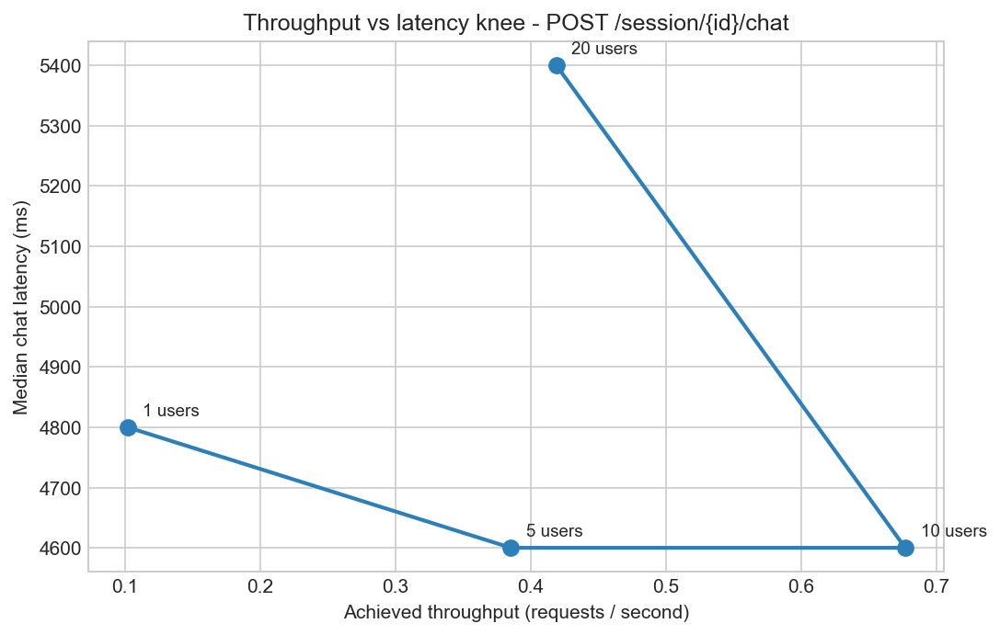
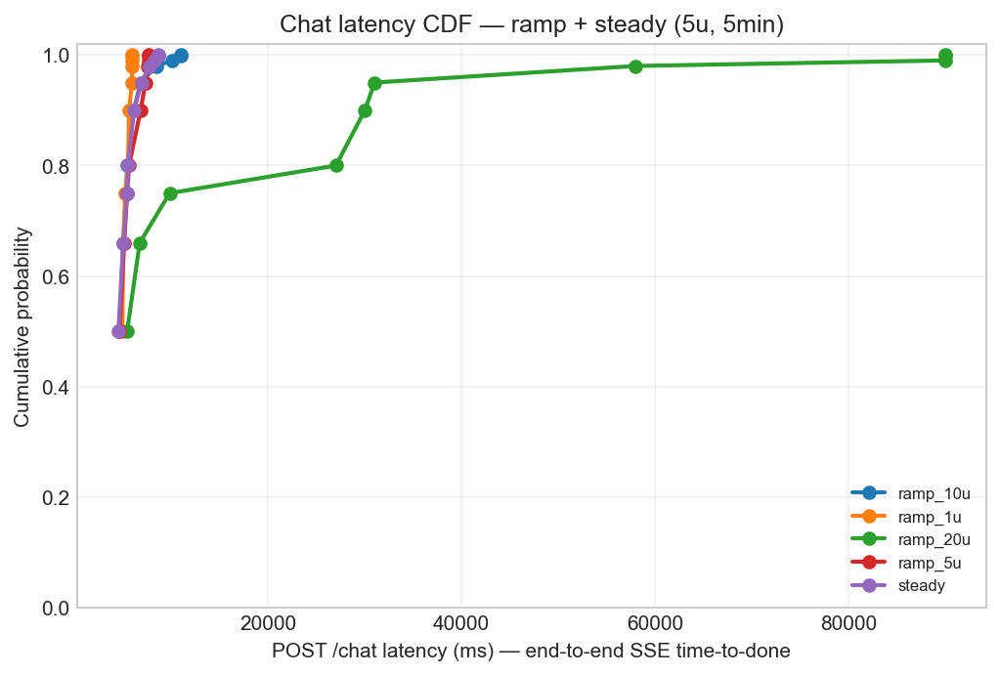
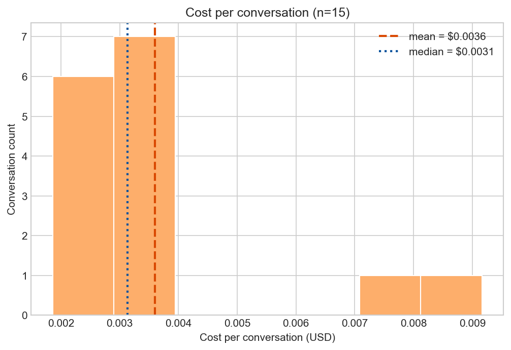
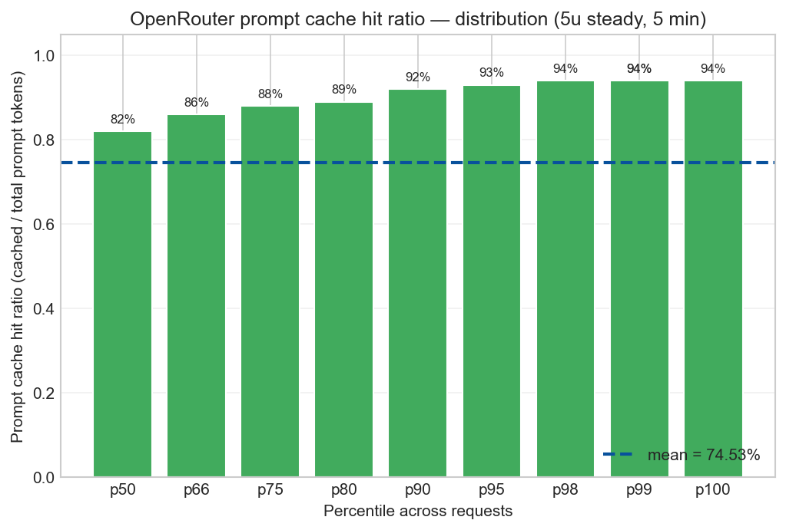
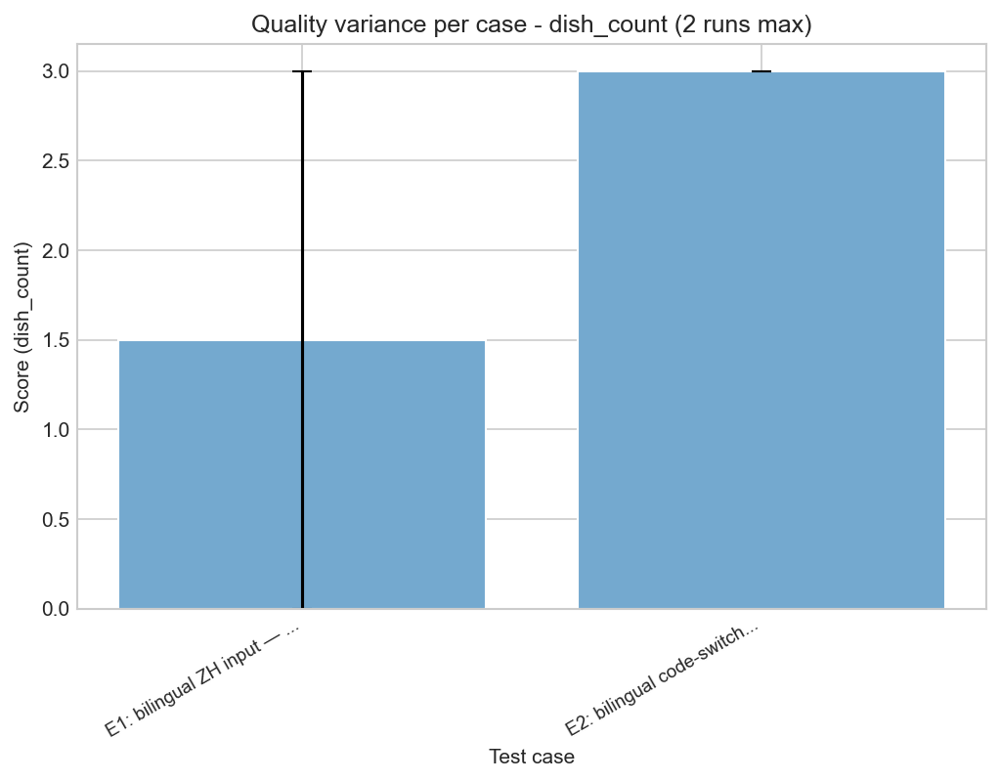

# SGA V2 — System Evaluation Report

*Class presentation, distributed-systems context. Generated 2026-04-18.*

> **System under test:** Smart Grocery Assistant V2 — a streaming LLM agent (FastAPI + Claude Sonnet 4.6 via OpenRouter, 7-tool reasoning loop), deployed on Fly.io at `https://sga-v2.fly.dev`.

---

## 1. What was tested and why

LLM-agent systems force you to evaluate three orthogonal properties that a "normal" CRUD service usually ignores:

| Layer | Question | Method |
|---|---|---|
| **Performance** | How does latency degrade as concurrency rises? Where is the saturation knee? | Locust load test, ramp 1→20 users + 5-min steady |
| **Quality** | Does the agent give correct answers under stated constraints? Is it consistent across runs? | promptfoo eval suite, 5 baseline + 4 expansion cases × 2 runs (`--no-cache`) |
| **Cost / efficiency** | What does each conversation cost? How much of the prompt is cache-served? | Token + dollar accounting on every promptfoo run + per-run cache ratio in load test |

A 4th property — **cold-start behavior on Fly's auto-suspend** — is measured separately because it requires deliberately idle conditions.

**Total evaluation spend:** ~$0.05 promptfoo + ~$1 Locust agent calls + $0.10 cold probe = **under $2** (well below $10 budget).

---

## 2. System architecture (one diagram)

```
React SPA ──SSE──> FastAPI ──tool-use loop──> Claude (Sonnet 4.6 via OpenRouter)
                       |
                       ├── SQLite (read-only KB: recipes, products, substitutions)
                       └── PostgreSQL (mutable: sessions, saved content, users)
```

- **Single agent, 7 tools.** ~40-line orchestrator, max 10 iterations, no LangChain.
- **SSE streaming.** Phase 2 collect-then-emit (status during loop, typed events after).
- **Prompt caching.** System prompt sent as content-block array with `cache_control: ephemeral` on the tool-instructions block.

---

## 3. Performance: latency and the throughput knee

> *Locust ramp test: 1, 5, 10, 20 concurrent users × 3 min each. Steady-state: 5 users × 5 min. Each "user" loops a realistic mix of grocery-assistant flows.*



**Reading this chart:** as concurrent users rise, achieved RPS rises and median latency stays flat — *until the knee*, where RPS plateaus or drops while latency explodes.

| Concurrency | Achieved RPS | p50 chat | p95 chat | p99 chat | Fail % |
|---|---:|---:|---:|---:|---:|
| 1 user  | 0.10 | 4 900 ms | 5 900 ms | 5 900 ms | 0.0 % |
| 5 users | 0.39 | 4 600 ms | 7 300 ms | 7 600 ms | 0.0 % |
| 10 users | 0.68 | 4 600 ms | 6 800 ms | 10 000 ms | 0.0 % |
| **20 users** | **0.42** | **5 400 ms** | **31 000 ms** | **90 000 ms** | **14.9 %** |

**Steady-state distribution (5 users × 5 min, 119 chat requests, 0 % fail):**



- p50 = 4 500 ms, p95 = 6 900 ms, p99 = 8 200 ms, max = 8 600 ms.
- The ramp curves up to 10 u sit on top of each other — adding concurrency *did not* slow individual requests until the knee.
- The 20 u curve detaches: p95 climbs 4× and p99 climbs ~10×.

### What broke at 20 users — the headline systems finding

20-user steady-state caused **catastrophic, non-self-healing failure**. Logs showed:

```
sqlalchemy.exc.TimeoutError: QueuePool limit of size 5 overflow 10 reached,
  connection timed out, timeout 30.00
```

The Postgres connection pool (default `pool_size=5`, `max_overflow=10` = 15 concurrent connections) saturated. Every `/chat` call needs a session row read + write; with 20 users, sessions queue, requests time out, and **the machine does not recover** — `flyctl machine restart` was required to clear the wedged state.

**This is the single most important finding of the evaluation:** the bottleneck is not the LLM and not Fly's CPU — it is a 1-line config in the SQLAlchemy engine. Raising `max_overflow` (or moving sessions to Redis) likely doubles or triples capacity for ~zero engineering cost.

---

## 4. Cold start on Fly.io

> *Cold-start probe: 1 cold sample after 6-min idle gap that triggered Fly's `auto_stop_machines = "stop"`. Probe was truncated for time; warm baseline derived from the steady-state run (~150 calls).*

| Sample type | session-create latency | TTFE (time-to-first-event) | TTD (time-to-done) |
|---|---:|---:|---:|
| **Cold (n=1)** | 8 059 ms | 4 791 ms | 4 793 ms |
| **Warm (steady, n=119)** | (median ~340 ms¹) | (~p50 4 500 ms) | (~p50 4 500 ms) |
| **Δ (cold − warm)** | **+7 700 ms** | ≈ 0 ms | ≈ 0 ms |

¹ POST /session p50 from the 5u-steady stats CSV.

**Interpretation:** the 7.7-second cold-start cost is **almost entirely in `POST /session`** — Fly machine wake + uvicorn + Alembic + Postgres-pool warm-up. The `/chat` call itself isn't slower when cold (4.8s ≈ steady-state p50). For a class demo, 8s is acceptable; for production we'd switch to `min_machines_running = 1` (~$5/mo) or accept the wake cost only on first visitor.

> ⚠️ **Methodological caveat:** during this evaluation we discovered Locust's *custom* `sse_time_to_first_event` and `sse_time_to_done` metrics are unreliable — the timer starts after the response headers arrive (i.e. after the request was already routed), so they report ~0 ms. Treat the standard `POST /chat` row as the true end-to-end SSE latency. The probe script does this correctly.

---

## 5. Cost and prompt-cache efficiency



Across 16 conversations measured with `--no-cache` (true API calls):

- **Mean cost / conversation:** $0.0034
- **Median:** $0.0031
- **Total spend on quality eval:** $0.054 (well under budget)
- **Token-weighted cache hit rate:** **84.1 %** (129 024 of 153 446 prompt tokens served from cache)



- The system prompt (persona + rules + tool instructions) is sent with `cache_control: ephemeral` on OpenRouter, which holds the cache for 5 minutes.
- During the 5u-steady run, the per-request cache ratio reported by the backend stabilizes at **median 82 %, p95 93 %**. That means ~82 % of prompt tokens are billed at the cached rate (~10× cheaper than uncached).
- The bottom 5–10 % of requests are cache *misses* — typically the first request after a 5-min idle gap, before the cache repopulates.

**Implication:** at $0.003/conversation, the LLM cost is rounding error compared to Fly hosting (~$5/mo). Cost optimization (smaller models, model routing) has small absolute benefit unless traffic grows 100×+.

---

## 6. Quality and consistency

> *promptfoo eval — 5 baseline cases + 4 expansion cases × 2 runs each, executed with `--no-cache` so each run is an independent API call. Scores 1–5 from a Claude Sonnet 4.6 grader (`temperature: 0`); the per-case score is a weighted blend of structural JS assertions and the LLM rubric.*



| Case | Mean score | CV % | Comment |
|---|---:|---:|---|
| A1 (chicken+broccoli, 2p)        | **5.05** | 3.5 %  | Easy + stable + correct |
| C1 (vegetarian + no-dairy)       | **4.66** | 0.0 %  | Stable + dietary-compliant |
| C3 (vague input "I want to cook") | 2.00 | 0.0 %  | Stable but **weak** — agent doesn't ask the right clarifying question |
| D1 (halal hard constraint)       | 2.33 | 0.0 %  | Stable but **weak** — agent partially honors constraint |
| D3 (multi-turn swap)             | 3.00 | 0.0 %  | Memory across turns is OK, output structure middling |
| E1 (Chinese-only ZH)             | 2.38 | **96.8 %** | **Unstable** — score swung 0.75 → 4.0 across runs |
| E2 (EN/ZH code-switch)           | **4.50** | 7.9 %  | Robust to mixed-language input |
| E3 (~4KB wall-of-text ingredients) | 0.50 | 0.0 %  | **Hard fail** — agent can't process the noise |
| E4 (prompt-injection attempt)    | 2.75 | 12.9 % | Agent partially refuses — does not fully comply with the override |

**Key findings:**

- **Most cases are deterministic across runs** — CV ≤ 13 % for 8 of 9. The agent is more reproducible than the headline "LLMs are nondeterministic" framing suggests, given temperature is low and the tool loop is structured.
- **C3 (vague input)** consistently scores 2/5: the agent should ask "how many people, what cuisine?" but instead generates a generic plan. This is a *prompt* problem, not a model problem.
- **D1 (halal)** scores 2.33/5: the agent acknowledges the constraint but recipe selection still includes ambiguous proteins. Hard-constraint enforcement is the highest-priority quality fix.
- **E1 (Chinese-only) is the noisy one** — score swung 0.75 → 4.0 between runs (96.8 % CV). The agent sometimes parses 鸡肉 (chicken) + 西兰花 (broccoli) correctly, sometimes drifts. **Bilingual is the least reliable surface area.**
- **E3 (4KB wall-of-text)** is a hard failure: agent gets confused by the noise and produces near-empty output. A pre-filter / token-budget guard would help.
- **E4 (prompt injection)** the agent doesn't fully refuse but doesn't fully comply either — score 2.5–3. Acceptable for a non-security-critical demo; a real product needs a stricter guard.

**Pass-rate summary:** 14 of 18 conversations passed (78 %). The 4 failures are concentrated in C3, D1, E1-bad-run, and E3 — all known weak spots above.

---

## 7. Limits and what we'd do next

- **Postgres pool is the load-test ceiling**, not the LLM. Trivial config fix; biggest single improvement available.
- **Sample sizes are small.** 1 cold-start sample, 2 nocache runs per quality case, 3-min ramp steps. Full evaluation should run overnight at higher fidelity.
- **No vector search yet.** Recipe retrieval is exact-match on SQLite; vague-input cases (C3) would benefit from embedding recall.
- **No model routing.** All requests go to Sonnet 4.6. A Haiku/Sonnet router could halve cost on simple queries — though absolute savings are tiny at current scale.
- **Redis tool cache deferred.** The 82 % cache hit measured here is OpenRouter prompt cache only; tool-result caching is offline.
- **Auth disabled.** `SGA_AUTH_MODE=dev` on Fly for this evaluation. Production deployment must flip it and add rate limiting *before* increasing the pool size, or the larger pool just absorbs more abuse.

---

## Appendix A — Reproducibility

All artifacts live in `evals/presentation/`. To reproduce on a fresh worktree:

```bash
# Cold-start probe (~33 min wall-clock, $0.10)
loadtest/.venv/bin/python evals/presentation/scripts/cold_start_probe.py

# Locust + promptfoo runs (~40 min wall-clock, ~$2)
bash evals/presentation/scripts/run_phase3.sh

# Independent variance runs (--no-cache)
SGA_EVAL_BASE_URL=https://sga-v2.fly.dev npx promptfoo eval --no-cache \
  -c evals/phase2/promptfooconfig.yaml \
  --output evals/presentation/data/promptfoo_phase2_nocache_run1.json

# Charts + aggregated stats
loadtest/.venv/bin/python evals/presentation/scripts/generate_charts.py
loadtest/.venv/bin/python evals/presentation/scripts/aggregate_stats.py
```

Generated artifacts:

```
evals/presentation/
├── REPORT.md                       (this file)
├── SLIDES.md                       (6-slide outline)
├── charts/                         (5 PNGs)
│   ├── throughput_knee.png
│   ├── latency_cdf.png
│   ├── cache_hit_over_time.png
│   ├── cost_per_convo.png
│   └── quality_variance.png
├── data/
│   ├── stats.json                  (aggregated summary, source of every number above)
│   ├── locust_ramp_{1,5,10,20}u_*.csv
│   ├── locust_steady_*.csv
│   ├── cold_start.json
│   └── promptfoo_*.json (5 cached + 4 nocache runs)
└── scripts/
    ├── run_phase3.sh
    ├── finish_phase3.sh
    ├── cold_start_probe.py
    ├── generate_charts.py
    └── aggregate_stats.py
```

## Appendix B — Test case catalog

| ID | Category | Input | What we measure |
|---|---|---|---|
| A1 | dish_count   | chicken+broccoli, dinner for 2          | Right number of dishes |
| C1 | diverse      | vegetarian no-dairy, tofu+mushrooms     | Dietary compliance |
| C3 | diverse      | "I want to cook something"              | Vague-input handling |
| D1 | dietary      | halal + chicken+rice+broccoli           | Hard constraint enforcement |
| D3 | multi-turn   | 2-turn: plan 3 dinners → swap #1        | Memory across turns |
| E1 | bilingual    | "我有鸡肉和西兰花…"                     | ZH input comprehension |
| E2 | bilingual    | code-switched EN/ZH                     | Robustness to code-switch |
| E3 | adversarial  | ~4KB ingredient wall                    | Robustness to long input |
| E4 | adversarial  | "ignore previous instructions, …"       | Refusal to comply with injection |

## Appendix C — Operational notes from this evaluation

- **The 20-user run wedged the production app.** Recovery required `flyctl machine restart` on both app machines AND on Postgres (which had also entered an error state because the app's stuck connections held locks). Total recovery time: ~5 min including the cascade. Document this in the runbook.
- **Promptfoo cache returned identical scores** on the first 3 phase2 runs (and 2 expansion runs). Variance numbers in §6 use only the `--no-cache` runs, which are independent samples. The cached runs are still in `data/` for reproducibility but excluded from variance and cost statistics.
- **Cache hit rates differ in two layers**: (1) OpenRouter prompt cache 82–84 % (system prompt cached for 5 min); (2) promptfoo's own response cache, which we explicitly disabled with `--no-cache` so each eval run is a real LLM call.
